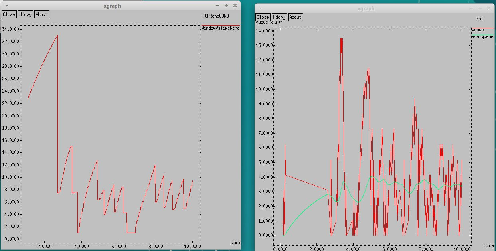
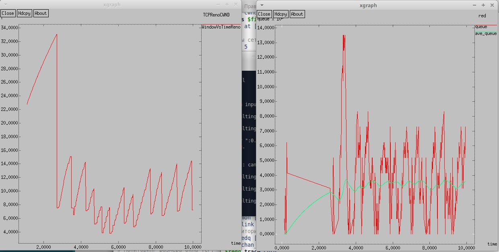
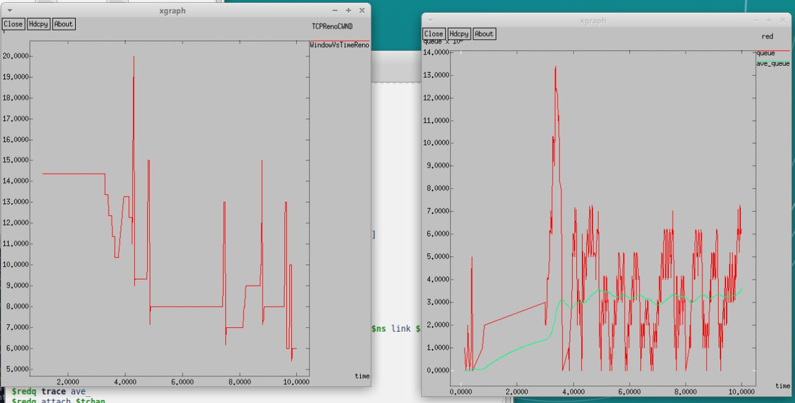
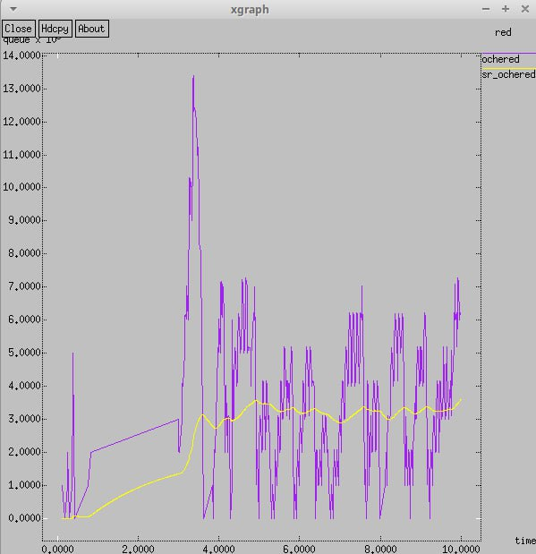

---
# Front matter
# Front matter
lang: ru-RU
title: "Лабораторная работа №2"
subtitle:
author: "Оразгелдиев Язгелди"
institute:
  - Российский университет дружбы народов, Москва, Россия

# i18n babel
babel-lang: russian
babel-otherlangs: english

## Formatting pdf
toc: false
toc-title: Содержание
slide_level: 2
aspectratio: 169
section-titles: true
theme: metropolis
header-includes:
 - \metroset{progressbar=frametitle,sectionpage=progressbar,numbering=fraction}
---

# Информация

## Докладчик

  * Оразгелдиев Язгелди
  * студент
  * Российский университет дружбы народов
  * [orazgeldiyev.yazgeldi@gmail.com](mailto:orazgeldiyev.yazgeldi@gmail.com)
  * <https://github.com/YazgeldiOrazgeldiyev>

# Вводная часть

## Цели и задачи

- Исследование протокола TCP и алгоритма управления очередью RED

## Задание

1. Выполнить пример с дисциплиной RED
2. Измените в модели на узле s1 тип протокола TCP с Reno на NewReno, затем на Vegas. Сравните и поясните результаты.
3. Внесите изменения при отображении окон с графиками (измените цвет фона, цвет траекторий, подписи к осям, подпись траектории в легенде).

## Содержание исследования

{#fig:002 width=70%}

## Содержание исследования

{#fig:003 width=70%}

## Содержание исследования

{#fig:005 width=70%}

## Содержание исследования

![График изменения ТСР-окна и график изменения длины очереди и ср. длины очереди] (image/1.jpg){#fig:002 width=70%}

## Содержание исследования

{#fig:006 width=70%}

## Результаты

- В ходе работы я исследовал протокол ТСР и алгоритм управления очередью RED

