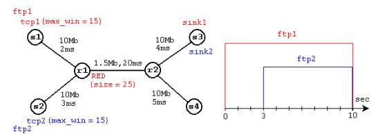
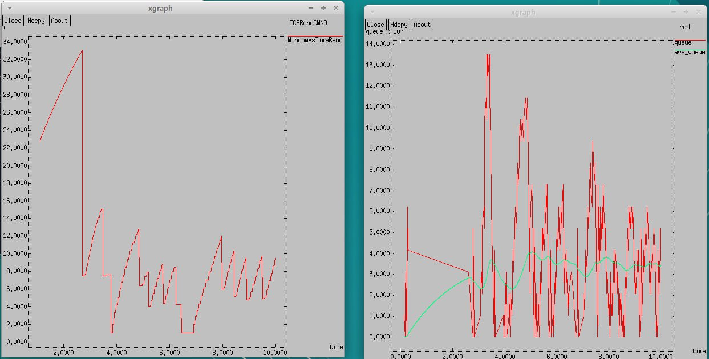
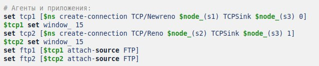
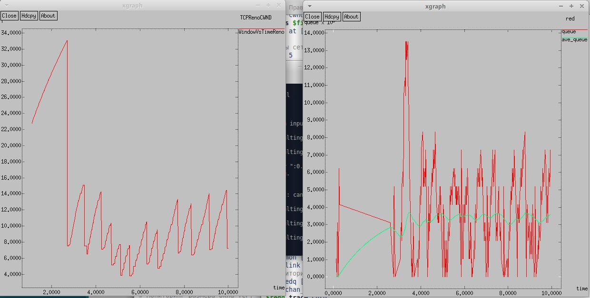
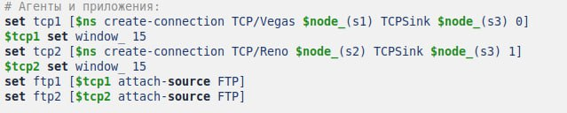
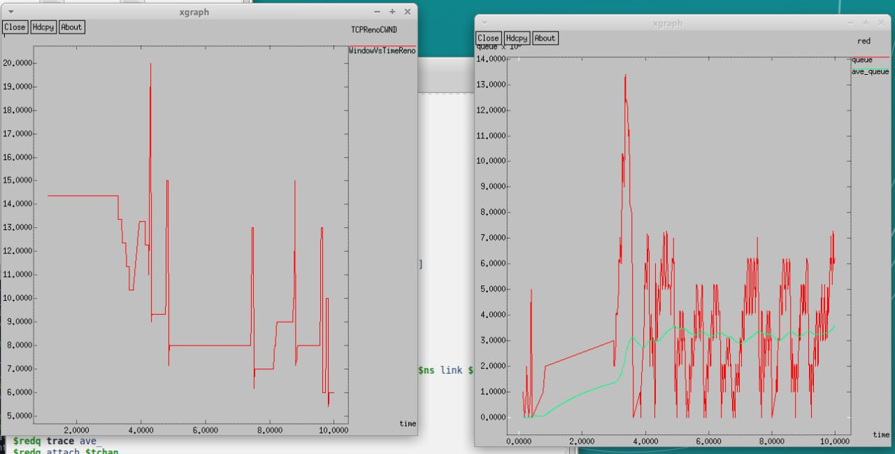
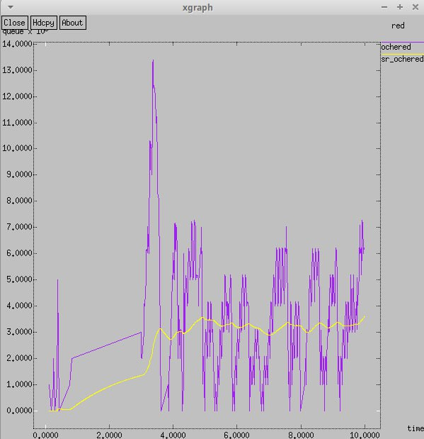

---
## Front matter
title: "Лабораторная работа 2"
subtitle: "Имитационное моделирование"
author: "Оразгелдиев Язгелди"

## Generic otions
lang: ru-RU
toc-title: "Содержание"

## Bibliography
bibliography: bib/cite.bib
csl: pandoc/csl/gost-r-7-0-5-2008-numeric.csl

## Pdf output format
toc: true # Table of contents
toc-depth: 2
lof: true # List of figures
lot: true # List of tables
fontsize: 12pt
linestretch: 1.5
papersize: a4
documentclass: scrreprt
## I18n polyglossia
polyglossia-lang:
  name: russian
  options:
	- spelling=modern
	- babelshorthands=true
polyglossia-otherlangs:
  name: english
## I18n babel
babel-lang: russian
babel-otherlangs: english
## Fonts
mainfont: IBM Plex Serif
romanfont: IBM Plex Serif
sansfont: IBM Plex Sans
monofont: IBM Plex Mono
mathfont: STIX Two Math
mainfontoptions: Ligatures=Common,Ligatures=TeX,Scale=0.94
romanfontoptions: Ligatures=Common,Ligatures=TeX,Scale=0.94
sansfontoptions: Ligatures=Common,Ligatures=TeX,Scale=MatchLowercase,Scale=0.94
monofontoptions: Scale=MatchLowercase,Scale=0.94,FakeStretch=0.9
mathfontoptions:
## Biblatex
biblatex: true
biblio-style: "gost-numeric"
biblatexoptions:
  - parentracker=true
  - backend=biber
  - hyperref=auto
  - language=auto
  - autolang=other*
  - citestyle=gost-numeric
## Pandoc-crossref LaTeX customization
figureTitle: "Рис."
tableTitle: "Таблица"
listingTitle: "Листинг"
lofTitle: "Список иллюстраций"
lotTitle: "Список таблиц"
lolTitle: "Листинги"
## Misc options
indent: true
header-includes:
  - \usepackage{indentfirst}
  - \usepackage{float} # keep figures where there are in the text
  - \floatplacement{figure}{H} # keep figures where there are in the text
---

# Цель работы

Исследование протокола TCP и алгоритма управления очередью RED

# Задание

1. Выполнить пример с дисциплиной RED
2. Измените в модели на узле s1 тип протокола TCP с Reno на NewReno, затем на Vegas. Сравните и поясните результаты.
3. Внесите изменения при отображении окон с графиками (измените цвет фона, цвет траекторий, подписи к осям, подпись траектории в легенде).

# Выполнение лабораторной работы

Выполним построение сети в соответствии с описанием.
{#fig:001 width=70%}
После запуска кода выше, получаем график изменения ТСР-окна и график изменения длины очереди и ср. длины очереди
{#fig:002 width=70%}

По графику мы видим что средняя длина очереди находится в отрезке 2 и 4. Максимальная длина - 14

Изменения протокола ТСР

В условии требуется изменить тип Reno на Newreno. Поэтому меняем следующий пункт кода

{#fig:002 width=70%}

По итогу получаем новый график изменений ТСР и график изменения длины очереди и средней длины очереди

{#fig:003 width=70%}

Сильных отличий от прошлого графика у нас нет. В обоих случаях средняя длина очереди находится в отрезке 2 и 4. 
Максимальная длина - 14. И кстати в обоих случаях размер окна увеличивается до тех пор, пока не произойдет потеря сегмента(пакета)

Теперь мы поменяем тип на Vegas

{#fig:004 width=70%}

Выводим график

{#fig:005 width=70%}

По графику мы видим, что средняя длина очереди опять находится в отрезке от 2 до 4, но значение длины чаще бывает меньше,
чем в прошлых типах. Максимальная длина - 14. Отличие мы видим по графику динамики размера окна. При типе Вегас размер окна
где-то 20, в то время как у Newreno он равен 34. ТСР Vegas находит перегруз в сети до потери пакета и моментально уменьшает размер
окна. Он обрабатывает перегрузку без потери пакета

Изменение отображения окон с графиками

Этот пункт чуть проще остальных. Нам необходимо было изменить цвет фона, траекторий, подпись к осям и подпись траекторий в легенде
Меняем код

Выводим на экран результат

{#fig:006 width=70%}

# Выводы

В ходе работы я исследовал протокол ТСР и алгоритм управления очередью RED

