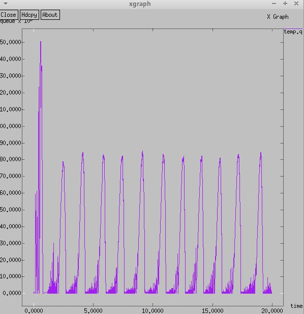

---
# Front matter
# Front matter
lang: ru-RU
title: "Лабораторная работа №4"
subtitle:
author: "Оразгелдиев Язгелди"
institute:
  - Российский университет дружбы народов, Москва, Россия

## i18n babel
babel-lang: russian
babel-otherlangs: english

## Formatting pdf
toc: false
toc-title: Содержание
slide_level: 2
aspectratio: 169
section-titles: true
theme: metropolis
header-includes:
 - \metroset{progressbar=frametitle,sectionpage=progressbar,numbering=fraction}
---

# Информация

## Докладчик

  * Оразгелдиев Язгелди
  * студент
  * Российский университет дружбы народов
  * [orazgeldiyev.yazgeldi@gmail.com](mailto:orazgeldiyev.yazgeldi@gmail.com)
  * <https://github.com/YazgeldiOrazgeldiyev>

## Объект и предмет исследования

- Xgraph
- GNUPLot

## Цели и задачи

1. Для приведённой схемы разработать имитационную модель в пакете NS-2.
2. Построить график изменения размера окна TCP (в Xgraph и в GNUPlot);
3. Построить график изменения длины очереди и средней длины очереди на первом
маршрутизаторе.
4. Оформить отчёт о выполненной работе.

## Материалы и методы

Описание моделируемой сети:
– сеть состоит из N TCP-источников, N TCP-приёмников, двух маршрутизаторов
R1 и R2 между источниками и приёмниками (N — не менее 20);
– между TCP-источниками и первым маршрутизатором установлены дуплексные
соединения с пропускной способностью 100 Мбит/с и задержкой 20 мс очередью
типа DropTail;
– между TCP-приёмниками и вторым маршрутизатором установлены дуплексные
соединения с пропускной способностью 100 Мбит/с и задержкой 20 мс очередью
типа DropTail;
– между маршрутизаторами установлено симплексное соединение (R1–R2) с пропускной способностью 20 Мбит/с и задержкой 15 мс очередью типа RED,
размером буфера 300 пакетов; в обратную сторону — симплексное соединение (R2–R1) с пропускной способностью 15 Мбит/с и задержкой 20 мс очередью
типа DropTail;
– данные передаются по протоколу FTP поверх TCPReno;
– параметры алгоритма RED: qmin = 75, qmax = 150, qw = 0, 002, pmax = 0.1;
– максимальный размер TCP-окна 32; размер передаваемого пакета 500 байт; время
моделирования — не менее 20 единиц модельного времени

## Содержание исследования

{#fig:001 width=40%}

## Содержание исследования

{#fig:002 width=40%}

## Содержание исследования

{#fig:003 width=40%}

## Содержание исследования

{#fig:004 width=40%}

## Содержание исследования

{#fig:005 width=40%}

## Содержание исследования

{#fig:006 width=40%}

## Содержание исследования

{#fig:007 width=40%}

## Содержание исследования

{#fig:008 width=40%}

## Содержание исследования

{#fig:009 width=40%}

## Результаты

При выполнении лабораторной работы я сделал задание для индивидуального выполнения.
