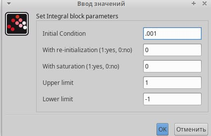

---
## Front matter
title: "Лабораторная работа 5"
subtitle: "Имитационное моделирование"
author: "Оразгелдиев Язгелди"

## Generic otions
lang: ru-RU
toc-title: "Содержание"

## Bibliography
bibliography: bib/cite.bib
csl: pandoc/csl/gost-r-7-0-5-2008-numeric.csl

## Pdf output format
toc: true # Table of contents
toc-depth: 2
lof: true # List of figures
lot: true # List of tables
fontsize: 12pt
linestretch: 1.5
papersize: a4
documentclass: scrreprt
## I18n polyglossia
polyglossia-lang:
  name: russian
  options:
	- spelling=modern
	- babelshorthands=true
polyglossia-otherlangs:
  name: english
## I18n babel
babel-lang: russian
babel-otherlangs: english
## Fonts
mainfont: IBM Plex Serif
romanfont: IBM Plex Serif
sansfont: IBM Plex Sans
monofont: IBM Plex Mono
mathfont: STIX Two Math
mainfontoptions: Ligatures=Common,Ligatures=TeX,Scale=0.94
romanfontoptions: Ligatures=Common,Ligatures=TeX,Scale=0.94
sansfontoptions: Ligatures=Common,Ligatures=TeX,Scale=MatchLowercase,Scale=0.94
monofontoptions: Scale=MatchLowercase,Scale=0.94,FakeStretch=0.9
mathfontoptions:
## Biblatex
biblatex: true
biblio-style: "gost-numeric"
biblatexoptions:
  - parentracker=true
  - backend=biber
  - hyperref=auto
  - language=auto
  - autolang=other*
  - citestyle=gost-numeric
## Pandoc-crossref LaTeX customization
figureTitle: "Рис."
tableTitle: "Таблица"
listingTitle: "Листинг"
lofTitle: "Список иллюстраций"
lotTitle: "Список таблиц"
lolTitle: "Листинги"
## Misc options
indent: true
header-includes:
  - \usepackage{indentfirst}
  - \usepackage{float} # keep figures where there are in the text
  - \floatplacement{figure}{H} # keep figures where there are in the text
---

# Цель работы

Построить модель xcos и OpenModelica

# Задание

– реализовать модель SIR с учётом процесса рождения / гибели особей в xcos (в
том числе и с использованием блока Modelica), а также в OpenModelica;
– построить графики эпидемического порога при различных значениях параметров
модели (в частности изменяя параметр µ);
– сделать анализ полученных графиков в зависимости от выбранных значений
параметров модели.

# Выполнение лабораторной работы

Задача о распространении эпидемии описывается системой дифференциальных уравнений

{#fig:001 width=70%}

где beta — скорость заражения, nu — скорость выздоровления.

Зафиксируем начальные данные beta = 1, nu = 0.3, s(0)=0.999, i(0)=0.001, r(0)=0. В меню Моделирование, Задать переменные окружения зададим значения переменных beta и nu. 

Для реализации модели (5.1) потребуются следующие блоки xcos:
– CLOCK_c — запуск часов модельного времени;
– CSCOPE — регистрирующее устройство для построения графика;
– TEXT_f — задаёт текст примечаний;
– MUX — мультиплексер, позволяющий в данном случае вывести на графике сразу
несколько кривых;
– INTEGRAL_m — блок интегрирования
– GAINBLK_f — в данном случае позволяет задать значения коэффициентов beta и nu;
– SUMMATION — блок суммирования;
– PROD_f — поэлементное произведение двух векторов на входе блока.

Реализуем модель из примера

{#fig:002 width=70%}

В параметрах верхнего и среднего блока интегрирования необходимо задать начальные значения s(0)=0.999, i(0)=0.001

{#fig:003 width=70%}

{#fig:004 width=70%}

В меню Моделирование, Установка зададим конечное время интегрирования, равным времени моделирования

{#fig:005 width=70%}

В итоге при запуске получится такой график

{#fig:006 width=70%}

Далее реализуем модель SIR с помощью блока Modelica в xcos. Для реализации модели с помощью языка Modelica помимо блоков CLOCK_c, CSCOPE, TEXT_f и MUX используем блоки CONST_m — задаёт константу; MBLOCK
(Modelica generic) — блок реализации кода на языке Modelica. Задаём значения переменных beta и nu

{#fig:007 width=70%}

{#fig:008 width=70%}

{#fig:009 width=70%}

В результате получаем такой график, построенный с помощью блока Modelica в xcos. Он идентичен прошлому графику

{#fig:010 width=70%}

Далее мы выполняем упражнение: реализуем модель SIR в OpenModelica.

Система схожа на обычную Modelica. Задаем параметры, начальные значения и систему дифф. уравнений.

{#fig:011 width=70%}

Теперь реализуем симуляцию с конечным временем 30с.

{#fig:012 width=70%}

После выполнения упражнения выполним задание для самостоятельного выполнения. Предположим, что учитываются демографические процессы, в частности, что смертность в популяции полностью уравновешивает рождаемость, а все рожденные индивидуумы появляются на свет абсолютно здоровыми. Тогда получим следующую систему
уравнений:

{#fig:013 width=70%}

Для начала реализуем модель в xcos. Тут нам понадобятся 3 блока суммирования и 4 блока констант. В итоге получаем такую схему:

{#fig:014 width=70%}

Запускаем и получаем такой график

{#fig:015 width=70%}

Теперь реализуем эту же модель с помощью блока Modelica

{#fig:016 width=70%}

Запускаем и получаем такой график как и в прошлом случаем

И последним этапом мы реализуем модель SIR в OpenModelica.

{#fig:017 width=70%}

Запускаем симуляцию и получаем следующий график

{#fig:018 width=70%}

Теперь мы пробуем задавать различные значения и выводить графики

{#fig:019 width=70%}

{#fig:020 width=70%}

Стоит сделать вывод, что при повышении значения параметров система достигает стационарного состояния. При высоком коэффициенте заражения beta система быстро проходит через
пик развития эпидемии и достигает стационарного состояния.

# Выводы

В процессе выполнения лабораторной работы построил модель SIR в xcos и OpenModelica.
