---
## Front matter
title: "Лабораторная работа 6"
subtitle: "Имитационное моделирование"
author: "Оразгелдиев Язгелди"

## Generic otions
lang: ru-RU
toc-title: "Содержание"

## Bibliography
bibliography: bib/cite.bib
csl: pandoc/csl/gost-r-7-0-5-2008-numeric.csl

## Pdf output format
toc: true # Table of contents
toc-depth: 2
lof: true # List of figures
lot: true # List of tables
fontsize: 12pt
linestretch: 1.5
papersize: a4
documentclass: scrreprt
## I18n polyglossia
polyglossia-lang:
  name: russian
  options:
	- spelling=modern
	- babelshorthands=true
polyglossia-otherlangs:
  name: english
## I18n babel
babel-lang: russian
babel-otherlangs: english
## Fonts
mainfont: IBM Plex Serif
romanfont: IBM Plex Serif
sansfont: IBM Plex Sans
monofont: IBM Plex Mono
mathfont: STIX Two Math
mainfontoptions: Ligatures=Common,Ligatures=TeX,Scale=0.94
romanfontoptions: Ligatures=Common,Ligatures=TeX,Scale=0.94
sansfontoptions: Ligatures=Common,Ligatures=TeX,Scale=MatchLowercase,Scale=0.94
monofontoptions: Scale=MatchLowercase,Scale=0.94,FakeStretch=0.9
mathfontoptions:
## Biblatex
biblatex: true
biblio-style: "gost-numeric"
biblatexoptions:
  - parentracker=true
  - backend=biber
  - hyperref=auto
  - language=auto
  - autolang=other*
  - citestyle=gost-numeric
## Pandoc-crossref LaTeX customization
figureTitle: "Рис."
tableTitle: "Таблица"
listingTitle: "Листинг"
lofTitle: "Список иллюстраций"
lotTitle: "Список таблиц"
lolTitle: "Листинги"
## Misc options
indent: true
header-includes:
  - \usepackage{indentfirst}
  - \usepackage{float} # keep figures where there are in the text
  - \floatplacement{figure}{H} # keep figures where there are in the text
---

# Цель работы

Реализовать модель «хищник – жертва» в OpenModelica, с использованием блока Мodelica в xcos, в xcos. Построить графики изменения численности популяций и фазовый портрет.

# Задание

1. Реализовать модель «хищник – жертва» в xcos.
2. Реализовать модель «хищник – жертва» с использованием блока Мodelica в xcos.
3. Реализовать модель «хищник – жертва» в OpenModelica.
 
# Выполнение лабораторной работы

Модель «хищник–жертва» (модель Лотки — Вольтерры) представляет собой модель межвидовой конкуренции. В математической форме модель имеет вид:

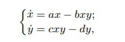{#fig:001 width=70%}

где x — количество жертв; y — количество хищников; a, b, c, d — коэффициенты, отражающие взаимодействия между видами: a — коэффициент рождаемости жертв; b — коэффициент убыли жертв; c — коэффициент рождения хищников; d —
коэффициент убыли хищников.

Сначала реализуем модель в xcos. 

Зафиксируем начальные данные: a = 2, b = 1, c = 0, 3, d = 1, x(0) = 2, y(0) = 1.
В меню Моделирование, Задать переменные окружения зададим значения коэффициентов a, b, c, d.

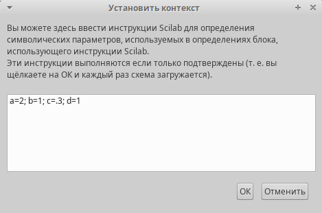{#fig:002 width=70%}

Для реализации модели (6.1) в дополнение к блокам CLOCK_c, CSCOPE, TEXT_f, MUX, INTEGRAL_m, GAINBLK_f, SUMMATION, PROD_f потребуется блок CSCOPXY — регистрирующее устройство для построения фазового портрета.

Готовая модель «хищник–жертва» представлена ниже

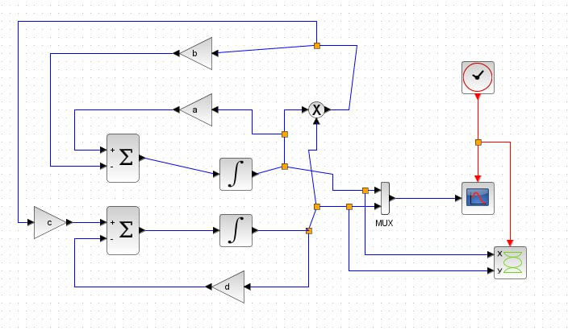{#fig:003 width=70%}

В параметрах блоков интегрировани необходимо задать начальные значения x(0) = 2, y(0) = 1

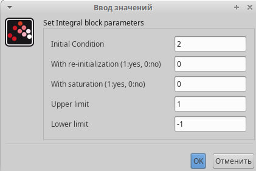{#fig:004 width=70%}

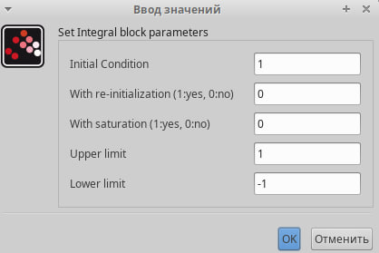{#fig:005 width=70%}

В меню Моделирование, Установка зададим конечное время интегрирования, равным времени моделирования: 30

Результат моделирования представлен ниже. Черная линия - график x(t)(динамика численности жертв), зеленая - у(t) (динамика численности хищников)

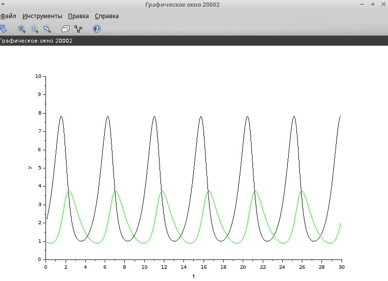{#fig:006 width=70%}

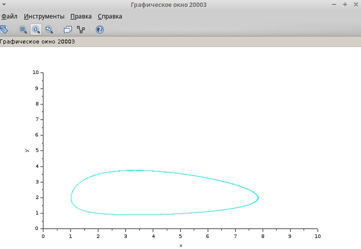{#fig:007 width=70%}

Реализация модели с  помощью блока Modelica в xcos

Для реализации модели с помощью языка Modelica потребуются следующие блоки xcos: CLOCK_c, CSCOPE, CSCOPXY, TEXT_f, MUX, CONST_m и MBLOCK (Modelica generic)

Как и ранее, задаём значения коэффициентов a, b, c, d. Готовая модель «хищник–жертва» представлена ниже на картинке. Переменные на входе (“a”, “b”, “c”, “d”) и выходе (“x”, “y”) блока заданы как внешние (“E”).

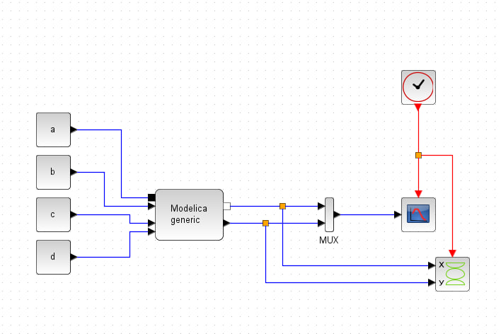{#fig:008 width=70%}

Параметры блока Modelica представлены ниже. 

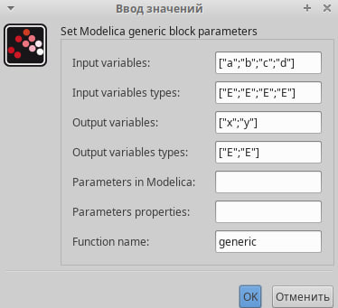{#fig:009 width=70%}

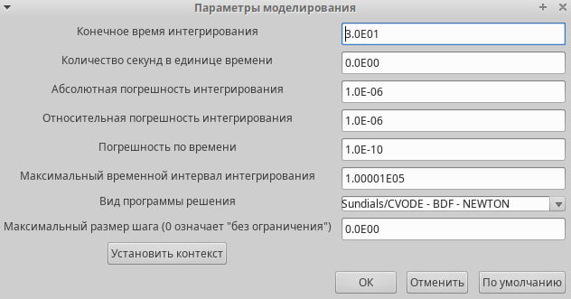{#fig:010 width=70%}

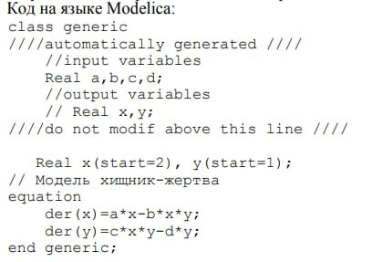{#fig:011 width=70%}

В результате получим два графика, идентичные предыдущим, реализованным с помощью xcos

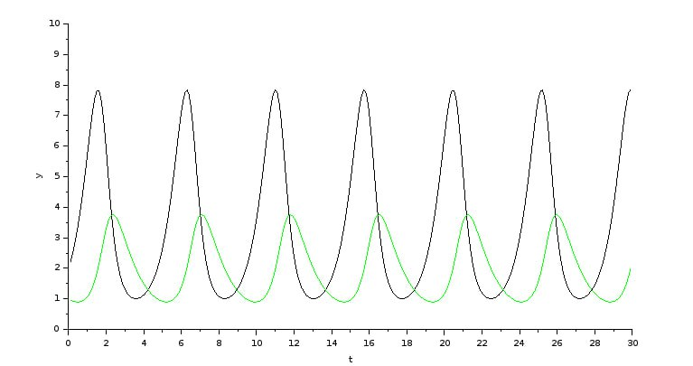{#fig:012 width=70%}

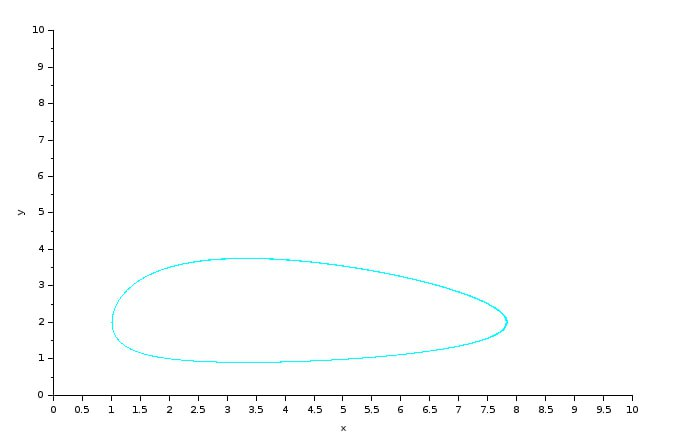{#fig:013 width=70%}

Далее нам реализуем модель «хищник – жертва» в OpenModelica. Построим графики изменения численности популяций в фазовый портрет

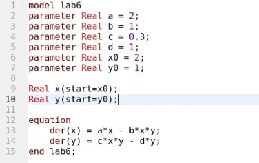{#fig:014 width=70%}

Выполним симуляцию и поставим конечное время 30с. Получим график изменения численности хищников и жертв, а еще фазовый портрет.

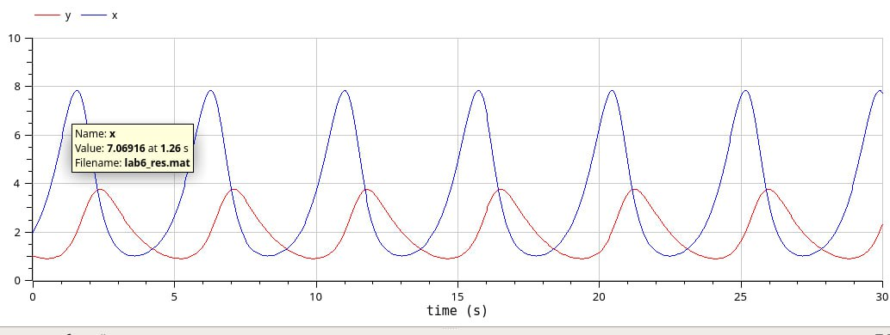{#fig:015 width=70%}

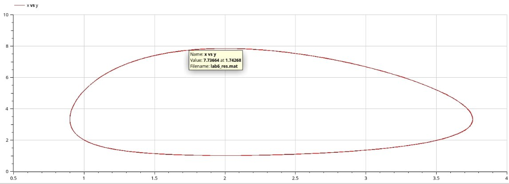{#fig:016 width=70%}

# Выводы

В ходе лабораторной работы я реализовал модель "хищник-жертва" в xcos, в xcos с применением блока Modelica и в OpenModelica.
