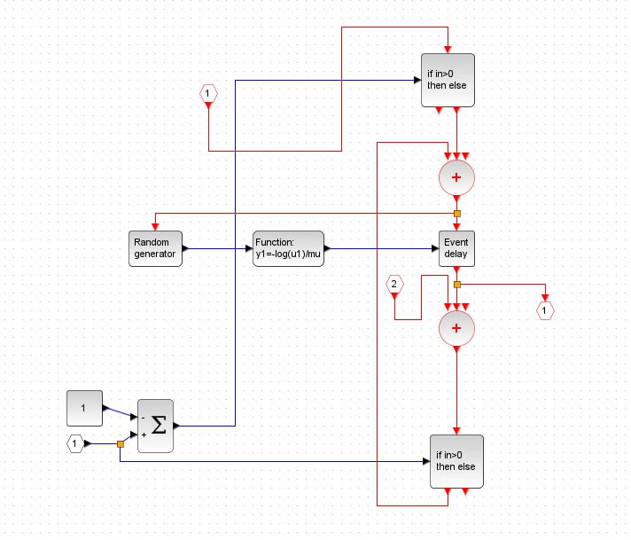

---
## Front matter
lang: ru-RU
title: Лабораторная работа 7
subtitle: Имитационное моделирование
author:
  - Оразгелдиев Язгелди
institute:
  - Российский университет дружбы народов, Москва, Россия

## i18n babel
babel-lang: russian
babel-otherlangs: english

## Formatting pdf
toc: false
toc-title: Содержание
slide_level: 2
aspectratio: 169
section-titles: true
theme: metropolis
header-includes:
 - \metroset{progressbar=frametitle,sectionpage=progressbar,numbering=fraction}
---

# Информация

## Докладчик

  * Оразгелдиев Язгелди
  * студент
  * Российский университет дружбы народов
  * [orazgeldiyev.yazgeldi@gmail.com](mailto:orazgeldiyev.yazgeldi@gmail.com)
  * <https://github.com/YazgeldiOrazgeldiyev>

## Цель работы

Рассмотреть пример моделирования системы массового обслуживания типа M|M|1|∞

## Задание

1. Реализовать модель системы массового обслуживания типа M|M|1|∞
2. Построить график поступления и обработки заявок
3. Построить график динамики размера очереди

## Содержание исследования

{#fig:001 width=60%}

## Содержание исследования

{#fig:002 width=60%}

## Содержание исследования

{#fig:003 width=50%}

## Содержание исследования

{#fig:004 width=50%}

## Содержание исследования

{#fig:005 width=50%}

## Содержание исследования

{#fig:006 width=50%}

## Содержание исследования

{#fig:007 width=50%}

## Результаты

- В процессе выполнения лабораторной работы я рассмотрел пример моделирования системы массового обслуживания типа M|M|1|∞.
