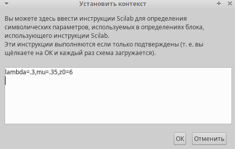
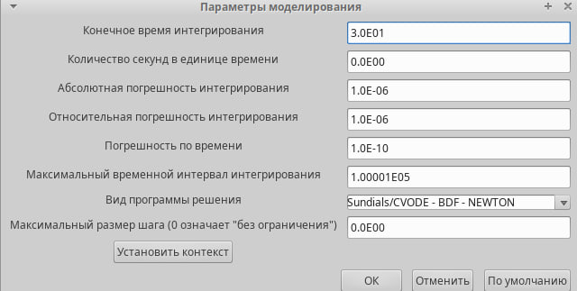
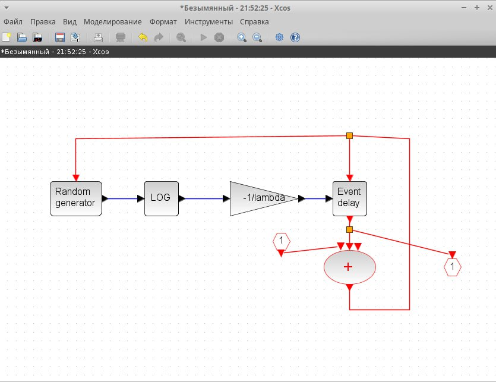
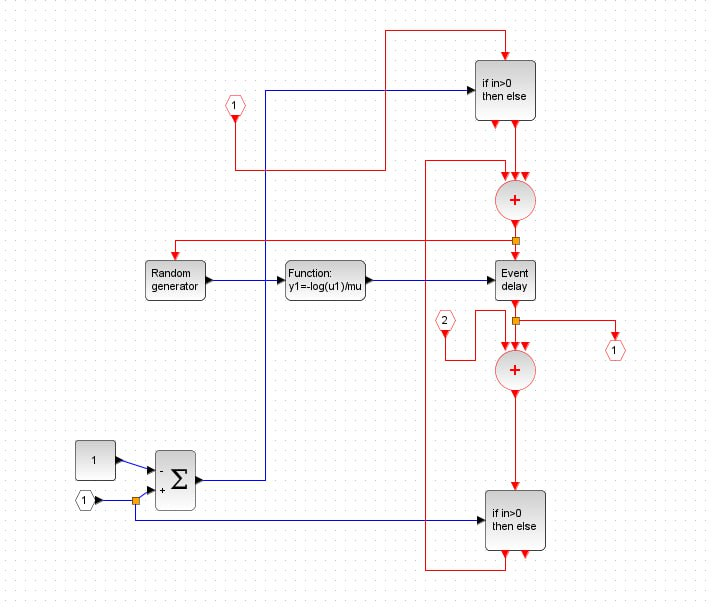
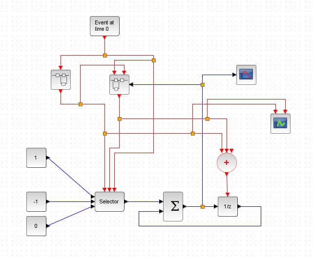
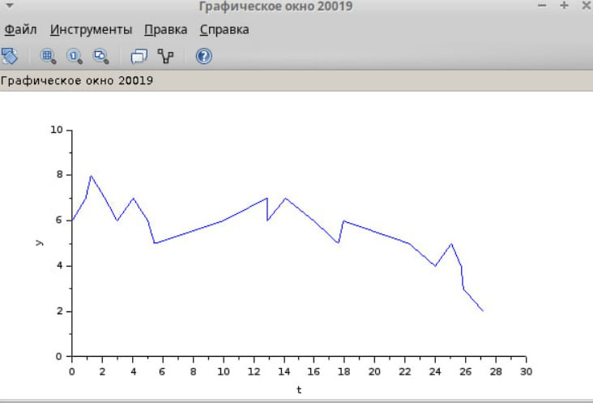
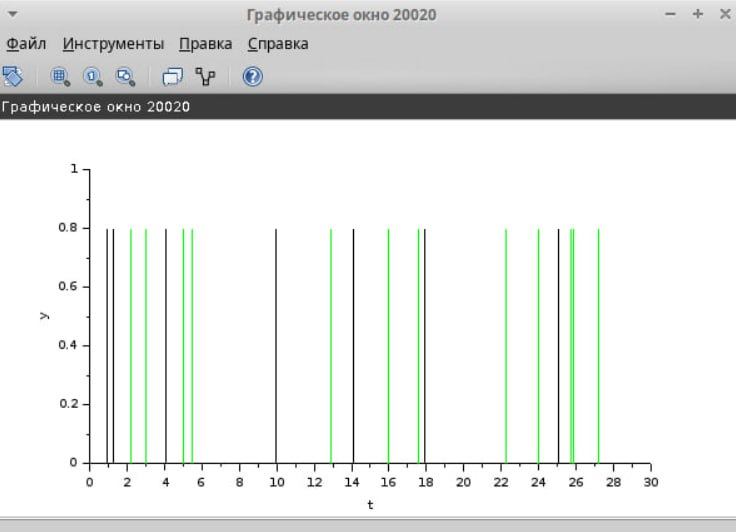

---
## Front matter
title: "Лабораторная работа 7"
subtitle: "Имитационное моделирование"
author: "Оразгелдиев Язгелди"

## Generic otions
lang: ru-RU
toc-title: "Содержание"

## Bibliography
bibliography: bib/cite.bib
csl: pandoc/csl/gost-r-7-0-5-2008-numeric.csl

## Pdf output format
toc: true # Table of contents
toc-depth: 2
lof: true # List of figures
lot: true # List of tables
fontsize: 12pt
linestretch: 1.5
papersize: a4
documentclass: scrreprt
## I18n polyglossia
polyglossia-lang:
  name: russian
  options:
	- spelling=modern
	- babelshorthands=true
polyglossia-otherlangs:
  name: english
## I18n babel
babel-lang: russian
babel-otherlangs: english
## Fonts
mainfont: IBM Plex Serif
romanfont: IBM Plex Serif
sansfont: IBM Plex Sans
monofont: IBM Plex Mono
mathfont: STIX Two Math
mainfontoptions: Ligatures=Common,Ligatures=TeX,Scale=0.94
romanfontoptions: Ligatures=Common,Ligatures=TeX,Scale=0.94
sansfontoptions: Ligatures=Common,Ligatures=TeX,Scale=MatchLowercase,Scale=0.94
monofontoptions: Scale=MatchLowercase,Scale=0.94,FakeStretch=0.9
mathfontoptions:
## Biblatex
biblatex: true
biblio-style: "gost-numeric"
biblatexoptions:
  - parentracker=true
  - backend=biber
  - hyperref=auto
  - language=auto
  - autolang=other*
  - citestyle=gost-numeric
## Pandoc-crossref LaTeX customization
figureTitle: "Рис."
tableTitle: "Таблица"
listingTitle: "Листинг"
lofTitle: "Список иллюстраций"
lotTitle: "Список таблиц"
lolTitle: "Листинги"
## Misc options
indent: true
header-includes:
  - \usepackage{indentfirst}
  - \usepackage{float} # keep figures where there are in the text
  - \floatplacement{figure}{H} # keep figures where there are in the text
---

# Цель работы

Рассмотреть пример моделирования системы массового обслуживания типа M|M|1|∞

# Задание

1. Реализовать модель системы массового обслуживания типа M|M|1|∞
2. Построить график поступления и обработки заявок
3. Построить график динамики размера очереди

# Выполнение лабораторной работы

Фиксируем данные начальные(задаем контекст) lambda = 0.3, mu=0.35, z0=6

{#fig:001 width=70%}

Кроме того, я задал параметры моделирования

{#fig:002 width=70%}

Суперблок моделирующий поступление заявок представлен ниже. Тут у нас заявки поступают в систему по пауссоновскому закону. Поступает заявка в суперблок, идёт в синхронизатор входных и выходных сигналов, происходит равномерное распределение на интервале [0, 1], еще заявка идёт в обработчик событий и выходит их суперблока. Далее идёт в преобразование в эскпоненциальное распределение с параметром lambda, далее заявка опять попадает в обработчик событий и выходит из суперблока

{#fig:003 width=50%}

Суперблок моделирующий процесс обработки заявок, представлен ниже на рисунке. Тут уже идёт обработка заявок в очереди по экспоненциальному закону

{#fig:004 width=50%}

Дальше вы можете видеть готовую модель M|M|1|∞. Тут есть селектор, два суперблока(которые мы описали выше), первоначальное событие на вход в суперблок, суммирование, оператор задержки(очередь), также регистрирующие блоки: регистратор размера очереди и регистратор событий.

{#fig:005 width=70%}

Результат моделирования представлен ниже. График динамики размера очереди начинается со значения 6, т.к. мы задали начальное значение z0=6

{#fig:006 width=70%}

Поступление и обработка заявок

{#fig:007 width=70%}

# Выводы

В процессе выполнения лабораторной работы я рассмотрел пример моделирования системы массового обслуживания типа M|M|1|∞.
