---
## Front matter
title: "Лабораторная работа 8"
subtitle: "Модель TCP/AQM"
author: "Оразгелдиев Язгелди"

## Generic otions
lang: ru-RU
toc-title: "Содержание"

## Bibliography
bibliography: bib/cite.bib
csl: pandoc/csl/gost-r-7-0-5-2008-numeric.csl

## Pdf output format
toc: true # Table of contents
toc-depth: 2
lof: true # List of figures
lot: true # List of tables
fontsize: 12pt
linestretch: 1.5
papersize: a4
documentclass: scrreprt
## I18n polyglossia
polyglossia-lang:
  name: russian
  options:
	- spelling=modern
	- babelshorthands=true
polyglossia-otherlangs:
  name: english
## I18n babel
babel-lang: russian
babel-otherlangs: english
## Fonts
mainfont: IBM Plex Serif
romanfont: IBM Plex Serif
sansfont: IBM Plex Sans
monofont: IBM Plex Mono
mathfont: STIX Two Math
mainfontoptions: Ligatures=Common,Ligatures=TeX,Scale=0.94
romanfontoptions: Ligatures=Common,Ligatures=TeX,Scale=0.94
sansfontoptions: Ligatures=Common,Ligatures=TeX,Scale=MatchLowercase,Scale=0.94
monofontoptions: Scale=MatchLowercase,Scale=0.94,FakeStretch=0.9
mathfontoptions:
## Biblatex
biblatex: true
biblio-style: "gost-numeric"
biblatexoptions:
  - parentracker=true
  - backend=biber
  - hyperref=auto
  - language=auto
  - autolang=other*
  - citestyle=gost-numeric
## Pandoc-crossref LaTeX customization
figureTitle: "Рис."
tableTitle: "Таблица"
listingTitle: "Листинг"
lofTitle: "Список иллюстраций"
lotTitle: "Список таблиц"
lolTitle: "Листинги"
## Misc options
indent: true
header-includes:
  - \usepackage{indentfirst}
  - \usepackage{float} # keep figures where there are in the text
  - \floatplacement{figure}{H} # keep figures where there are in the text
---

# Цель работы

Реализуйте модель TCP/AQM в xcos и OpenModelica

# Задание

1. Реализуйте модель TCP/AQM в xcos
2. Построить графики динамии изменения размера ТСР окна W(t) и размера очереди Q(t)
3. Построить модель ТCP/AQM в OpenModelica

# Выполнение лабораторной работы

Построим схему xcos, моделирующую нашу систему с начальными значениями параметров N=1, R=1, K=5.3, C=1, W(0)=0.1, Q(0)=1. Для этого сначала зададим переменные окружения.

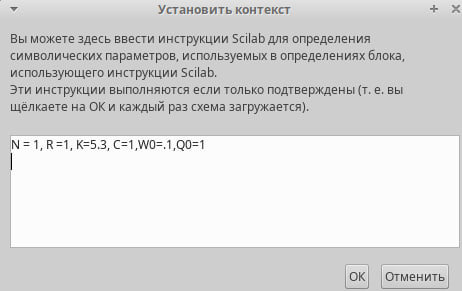{#fig:001 width=70%}

Еще зададим параметры моделирования

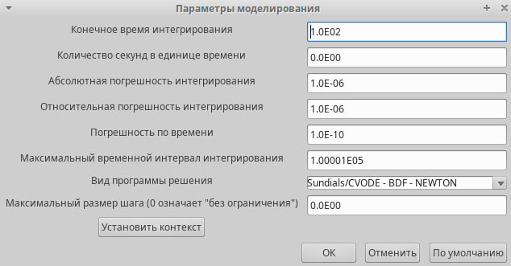{#fig:002 width=70%}

Установим начальные значения в блоках интегрирования

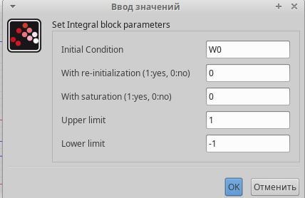{#fig:003 width=70%}

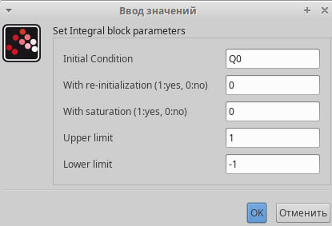{#fig:004 width=70%}

Установим параметры задержки

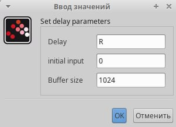{#fig:005 width=70%}

Запись выражения определяющего Q(t) в блок Expression

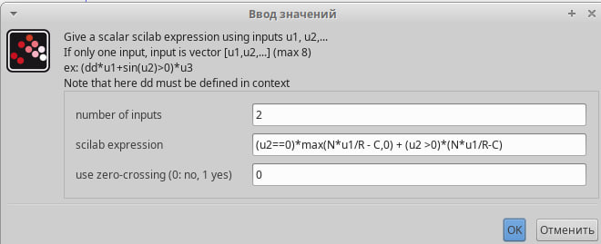{#fig:006 width=70%}

Установим параметры регистрирующих устройств для оптимального отображения графиков. Еще у блока CSCOPE ставим параметр refresh period =100, чтобы на графики отобразились результаты моделирования в течение 100 секунд модельного времени.

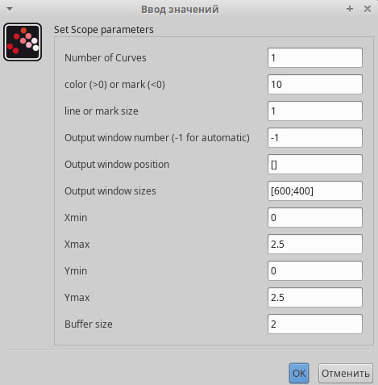{#fig:007 width=70%}

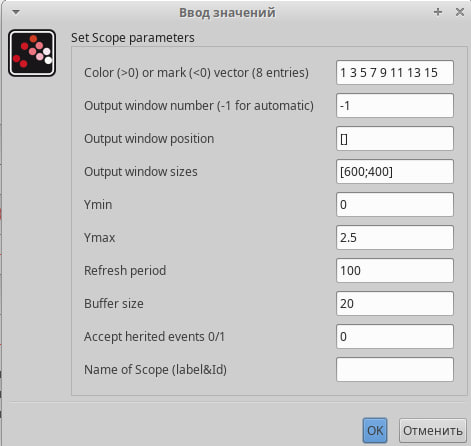{#fig:008 width=70%}

Затем реализуем модель, разместив блоки интегрирования, суммирования, произведения, контсант, и регистрирующие устройства CSCOPE и CSCOPEXY для фазового портрета

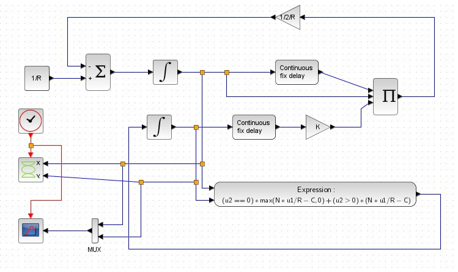{#fig:009 width=70%}

Получим динамику изменения размера ТСР окна W(t) (зеленая линия) и размера очереди Q(t)(Черная линия), а также фазовый портрет который показывает наличие автоколебаний параметров системы - фазовая траектория осциллирует вокруг своей стацнионарной точки

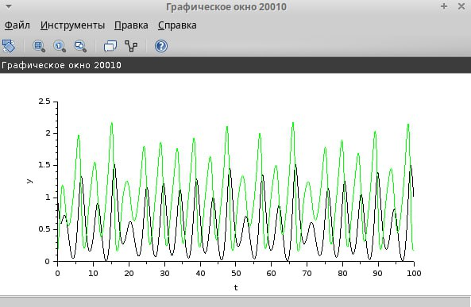{#fig:010 width=70%}

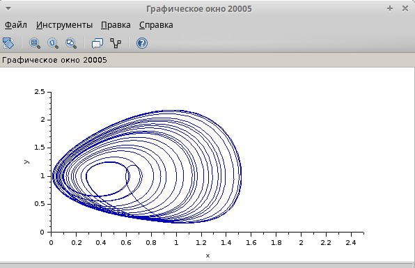{#fig:011 width=70%}

Уменьшим скорость обработки пакетов С до 0.9, увидим, что автоколебания стали более выраженными

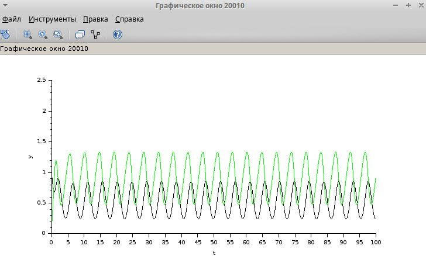{#fig:012 width=70%}

Далее мы реализуем нашу модель в OpenModelica. Зададим параметры, начальные значения и СДУ

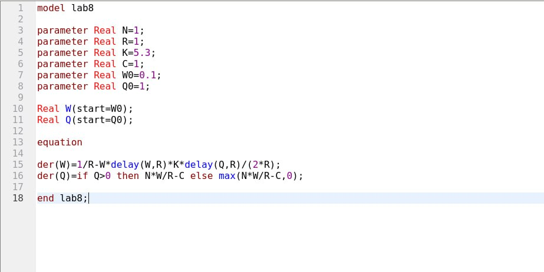{#fig:013 width=70%}

Затем установим параметры симуляции - 100 единиц модельного времени. В результате получим динамику изменения размера ТСР окна W(t) (красная линия) и размера очереди Q(t)(синяя линия), а также фазовый портрет, показывающий наличие автоколебаний параметров системы - фазовая траектория осциллирует вокруг своей стационарной точки

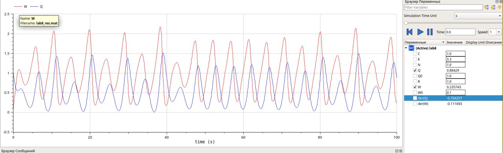{#fig:014 width=70%}

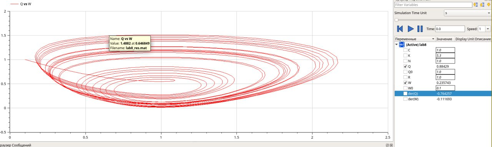{#fig:015 width=70%}

Изменим скорость обработки пакетов С до 0.9

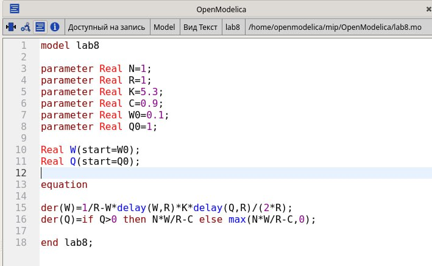{#fig:016 width=70%}

Увидим как и в xcos, что колебания стали более выраженными

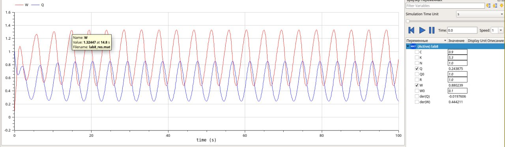{#fig:017 width=70%}

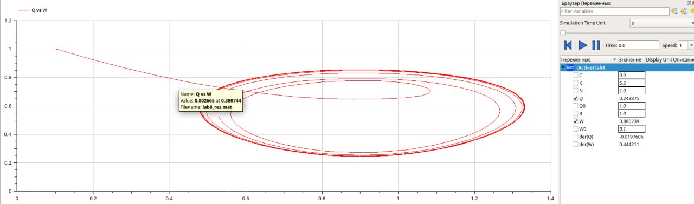{#fig:018 width=70%}

# Выводы

При выполнении данной лабораторной работы я реализовал модель ТСР/AQM в xcos и OpenModelica
