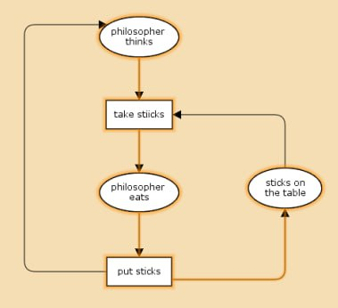
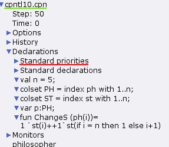
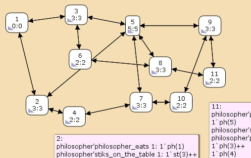

---
## Front matter
lang: ru-RU
title: Лабораторная работа 10
subtitle: Задача об обедающих мудрецах
author:
  - Оразгелдиев Язгелди
institute:
  - Российский университет дружбы народов, Москва, Россия

## i18n babel
babel-lang: russian
babel-otherlangs: english

## Formatting pdf
toc: false
toc-title: Содержание
slide_level: 2
aspectratio: 169
section-titles: true
theme: metropolis
header-includes:
 - \metroset{progressbar=frametitle,sectionpage=progressbar,numbering=fraction}
---

# Информация

## Докладчик

  * Оразгелдиев Язгелди
  * студент
  * Российский университет дружбы народов
  * [orazgeldiyev.yazgeldi@gmail.com](mailto:orazgeldiyev.yazgeldi@gmail.com)
  * <https://github.com/YazgeldiOrazgeldiyev>

## Цель работы

Попрактиковаться в работе с и реализовать модель задачи об обедающих мудрецах CPNTools.

## Задание

Пять мудрецов сидят за круглым столом и могут пребывать в двух состояниях —
думать и есть. Между соседями лежит одна палочка для еды. Для приёма пищи необходимы две палочки. Палочки — пересекающийся ресурс. Необходимо синхронизировать процесс еды так, чтобы мудрецы не умерли с голода

Вычислите пространство состояний. Сформируйте отчёт о пространстве состояний и проанализируйте его. Постройте граф пространства состояний.

## Содержание исследования

{#fig:001 width=40%}

## Содержание исследования

{#fig:002 width=40%}

## Содержание исследования

{#fig:003 width=40%}

## Содержание исследования

- Есть 11 состояний и 30 переходов между ними
- указаны границы значений для каждого элемента: думающие мудрецы(минимум - 3, максимум их 5), едящих мудрецов от 0 до 2, палочек на столе (минимум 1, максимум 5, и минимальное значение 2, т.к. к концу симуляции остаются пироги)
- указаны границы в виде мультимножеств
- маркировка home для всех состояний
- маркрировка Dead равна None
- указано что бесконечно часто происходят события положить и взять палочку

## Содержание исследования

{#fig:004 width=70%}

## Результаты

В процессе выполнения работы реализовали модель задачи об обедающих мудрецах в CPNTools
