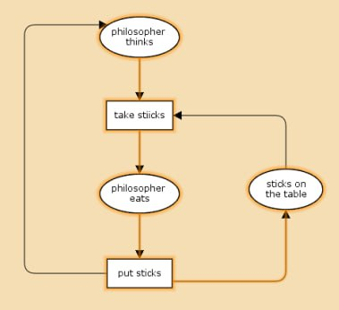
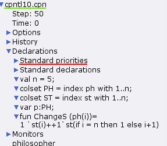
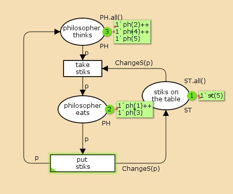
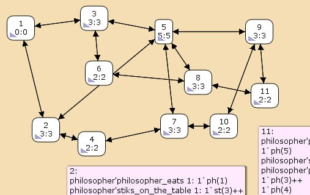

---
## Front matter
title: "Лабораторная работа 10"
subtitle: "Задача об обедающих мудрецах"
author: "Оразгелдиев Язгелди"

## Generic otions
lang: ru-RU
toc-title: "Содержание"

## Bibliography
bibliography: bib/cite.bib
csl: pandoc/csl/gost-r-7-0-5-2008-numeric.csl

## Pdf output format
toc: true # Table of contents
toc-depth: 2
lof: true # List of figures
lot: true # List of tables
fontsize: 12pt
linestretch: 1.5
papersize: a4
documentclass: scrreprt
## I18n polyglossia
polyglossia-lang:
  name: russian
  options:
	- spelling=modern
	- babelshorthands=true
polyglossia-otherlangs:
  name: english
## I18n babel
babel-lang: russian
babel-otherlangs: english
## Fonts
mainfont: IBM Plex Serif
romanfont: IBM Plex Serif
sansfont: IBM Plex Sans
monofont: IBM Plex Mono
mathfont: STIX Two Math
mainfontoptions: Ligatures=Common,Ligatures=TeX,Scale=0.94
romanfontoptions: Ligatures=Common,Ligatures=TeX,Scale=0.94
sansfontoptions: Ligatures=Common,Ligatures=TeX,Scale=MatchLowercase,Scale=0.94
monofontoptions: Scale=MatchLowercase,Scale=0.94,FakeStretch=0.9
mathfontoptions:
## Biblatex
biblatex: true
biblio-style: "gost-numeric"
biblatexoptions:
  - parentracker=true
  - backend=biber
  - hyperref=auto
  - language=auto
  - autolang=other*
  - citestyle=gost-numeric
## Pandoc-crossref LaTeX customization
figureTitle: "Рис."
tableTitle: "Таблица"
listingTitle: "Листинг"
lofTitle: "Список иллюстраций"
lotTitle: "Список таблиц"
lolTitle: "Листинги"
## Misc options
indent: true
header-includes:
  - \usepackage{indentfirst}
  - \usepackage{float} # keep figures where there are in the text
  - \floatplacement{figure}{H} # keep figures where there are in the text
---

# Цель работы

Попрактиковаться в работе с и реализовать модель задачи об обедающих мудрецах CPNTools.

# Задание

Пять мудрецов сидят за круглым столом и могут пребывать в двух состояниях —
думать и есть. Между соседями лежит одна палочка для еды. Для приёма пищи необходимы две палочки. Палочки — пересекающийся ресурс. Необходимо синхронизировать процесс еды так, чтобы мудрецы не умерли с голода

Вычислите пространство состояний. Сформируйте отчёт о пространстве состояний и проанализируйте его. Постройте граф пространства состояний.

# Выполнение лабораторной работы

Рисуем граф сети. Для этого с помощью контекстного меню создаём новую сеть, добавляем позиции, переходы и дуги.
Начальные данные:
- позиции: мудрец размышляет (philosopher thinks), мудрец ест (philosopher eats),
палочки находятся на столе (sticks on the table)
- переходы: взять палочки (take sticks), положить палочки (put sticks)

{#fig:001 width=70%}

 В меню задаём новые декларации модели: типы фишек, начальные значения
позиций, выражения для дуг:
– n — число мудрецов и палочек (n = 5);
– p — фишки, обозначающие мудрецов, имеют перечисляемый тип PH от 1 до n;
– s — фишки, обозначающие палочки, имеют перечисляемый тип ST от 1 до n;
– функция ChangeS(p) ставит в соответствие мудрецам палочки (возвращает номера палочек, используемых мудрецами); по условию задачи мудрецы сидят по
кругу и мудрец p(i) может взять i и i + 1 палочки, поэтому функция ChangeS(p)
определяется следующим образом
```
fun ChangeS (ph(i))=
1`st(i)++st(if = n then 1 else i+1)
```
{#fig:002 width=70%}

В результате получаем работающую модель. После запуска модели наблюдаем, что одновременно палочками могут воспользоваться только два из пяти мудрецов.

{#fig:003 width=70%}

Упражнение.
Вычислим пространство состояний. Сформируем отчёт о пространстве состояний и проанализируем его. Для этого мы входим в пространство состояний, затем вычисляем пространство состояний и формируем отчёт(задаём ему какое-нибудь имя). Сохранить отчёт можно с помощью инструмента Save report.

Открываем сохраненный отчёт и видим следующее.

- Есть 11 состояний и 30 переходов между ними
- указаны границы значений для каждого элемента: думающие мудрецы(минимум - 3, максимум их 5), едящих мудрецов от 0 до 2, палочек на столе (минимум 1, максимум 5, и минимальное значение 2, т.к. к концу симуляции остаются пироги)
- указаны границы в виде мультимножеств
- маркировка home для всех состояний
- маркрировка Dead равна None
- указано что бесконечно часто происходят события положить и взять палочку

```
CPN Tools state space report for:
/home/openmodelica/cpntl10.cpn
Report generated: Sat Apr 12 14:58:45 2025


 Statistics
------------------------------------------------------------------------

  State Space
     Nodes:  11
     Arcs:   30
     Secs:   0
     Status: Full

  Scc Graph
     Nodes:  1
     Arcs:   0
     Secs:   0


 Boundedness Properties
------------------------------------------------------------------------

  Best Integer Bounds
                             Upper      Lower
     philosopher'philosopher_eats 1
                             2          0
     philosopher'philosopher_thinks 1
                             5          3
     philosopher'stiks_on_the_table 1
                             5          1

  Best Upper Multi-set Bounds
     philosopher'philosopher_eats 1
                         1`ph(1)++
1`ph(2)++
1`ph(3)++
1`ph(4)++
1`ph(5)
     philosopher'philosopher_thinks 1
                         1`ph(1)++
1`ph(2)++
1`ph(3)++
1`ph(4)++
1`ph(5)
     philosopher'stiks_on_the_table 1
                         1`st(1)++
1`st(2)++
1`st(3)++
1`st(4)++
1`st(5)

  Best Lower Multi-set Bounds
     philosopher'philosopher_eats 1
                         empty
     philosopher'philosopher_thinks 1
                         empty
     philosopher'stiks_on_the_table 1
                         empty


 Home Properties
------------------------------------------------------------------------

  Home Markings
     All


 Liveness Properties
------------------------------------------------------------------------

  Dead Markings
     None

  Dead Transition Instances
     None

  Live Transition Instances
     All


 Fairness Properties
------------------------------------------------------------------------
       philosopher'put_stiks 1
                         Impartial
       philosopher'take_stiks 1
                         Impartial
```

Построили граф пространства состояний

{#fig:004 width=70%}

# Выводы

В процессе выполнения работы реализовали модель задачи об обедающих мудрецах в CPNTools
