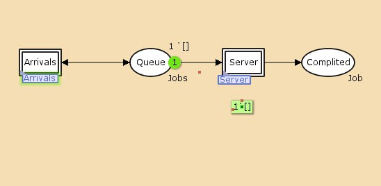

---
## Front matter
lang: ru-RU
title: Лабораторная работа 11
subtitle: Модель системы массового обслуживания M|M|1
author:
  - Оразгелдиев Язгелди
institute:
  - Российский университет дружбы народов, Москва, Россия

## i18n babel
babel-lang: russian
babel-otherlangs: english

## Formatting pdf
toc: false
toc-title: Содержание
slide_level: 2
aspectratio: 169
section-titles: true
theme: metropolis
header-includes:
 - \metroset{progressbar=frametitle,sectionpage=progressbar,numbering=fraction}
---

# Информация

## Докладчик

  * Оразгелдиев Язгелди
  * студент
  * Российский университет дружбы народов
  * [orazgeldiyev.yazgeldi@gmail.com](mailto:orazgeldiyev.yazgeldi@gmail.com)
  * <https://github.com/YazgeldiOrazgeldiyev>

## Цель работы

Реализовать модель M|M|1 в CPNTools

## Задание

- Реализовать модель  системы массового обслуживания M|M|1
- Настроить мониторинг параметров моделируемой системы и нарисовать графики очереди

## Содержание исследования

{#fig:001 width=50%}

## Содержание исследования

{#fig:002 width=50%}

## Содержание исследования

{#fig:003 width=50%}

## Содержание исследования

{#fig:004 width=30%}

## Содержание исследования

{#fig:005 width=50%}

## Содержание исследования

{#fig:006 width=50%}

## Содержание исследования

{#fig:007 width=50%}

## Содержание исследования

{#fig:008 width=50%}

## Содержание исследования

{#fig:009 width=50%}

## Содержание исследования

{#fig:010 width=50%}

## Содержание исследования

{#fig:011 width=50%}

## Содержание исследования

{#fig:012 width=50%}

## Содержание исследования

{#fig:013 width=40%}

## Содержание исследования

{#fig:014 width=50%}

## Содержание исследования

{#fig:015 width=50%}

## Содержание исследования

{#fig:016 width=50%}

## Содержание исследования

{#fig:017 width=70%}

## Содержание исследования

{#fig:018 width=70%}

## Содержание исследования

{#fig:019 width=50%}

## Содержание исследования

{#fig:020 width=50%}

## Результаты

- В процессе лабораторной работы мы реализовали модель системы массового обслуживания M|M|1 в CPNTools
