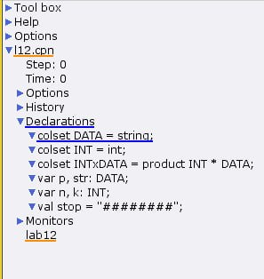
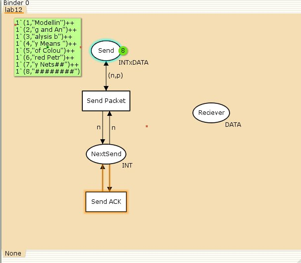
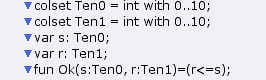
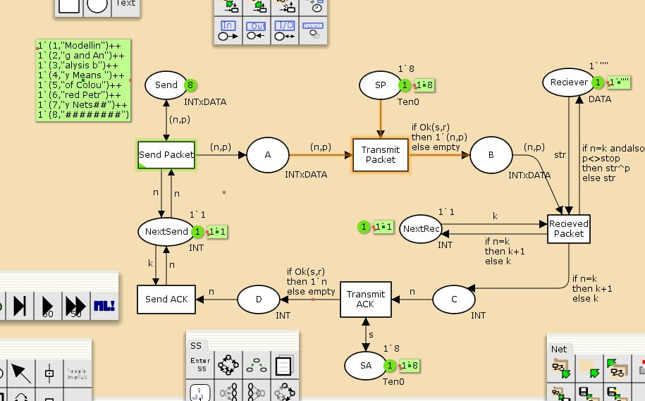
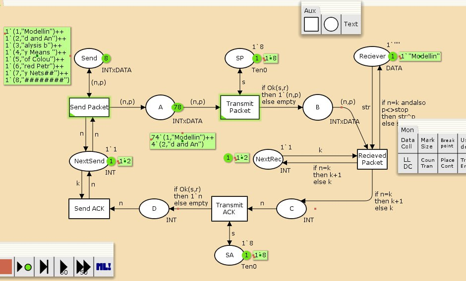
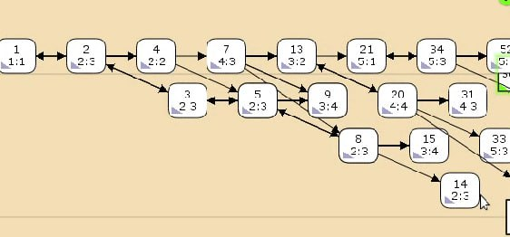

---
## Front matter
lang: ru-RU
title: Лабораторная работа 12
subtitle: Пример моделирования простого протокола передачи данных
author:
  - Оразгелдиев Язгелди
institute:
  - Российский университет дружбы народов, Москва, Россия

## i18n babel
babel-lang: russian
babel-otherlangs: english

## Formatting pdf
toc: false
toc-title: Содержание
slide_level: 2
aspectratio: 169
section-titles: true
theme: metropolis
header-includes:
 - \metroset{progressbar=frametitle,sectionpage=progressbar,numbering=fraction}
---

# Информация

## Докладчик

  * Оразгелдиев Язгелди
  * студент
  * Российский университет дружбы народов
  * [orazgeldiyev.yazgeldi@gmail.com](mailto:orazgeldiyev.yazgeldi@gmail.com)
  * <https://github.com/YazgeldiOrazgeldiyev>

## Цель работы

Реализовать простой протокол передачи данных в CPNTools

## Задание

- Реализуйте простой протокол передачи данных в CPNTools
- Вычислите пространство состояний. Сформируйте отчёт о пространстве состояний и проанализируйте его. Постройте граф пространства состояний.

## Содержание исследования

{#fig:001 width=40%}

## Содержание исследования

{#fig:002 width=50%}

## Содержание исследования

{#fig:003 width=50%}

## Содержание исследования

{#fig:004 width=50%}

## Содержание исследования

{#fig:005 width=50%}

## Содержание исследования

Вычислим пространство состояний.Для этого входим в пространство состояний, вычисляем пространство состояний и формируем отчёт. Из него мы выявим, что:
Состояний: 13341
Переходов:   206461
Указаны границы значений для каждого элемента промежуточные состояния А В С
Указаны границы в виде мультимножеств
Маркировка dead равна 4675

## Содержание исследования

{#fig:006 width=70%}

## Результаты

В ходе работы я реализовал простой протокол передачи данных и провел его анализ(анализ пространства состояний)
