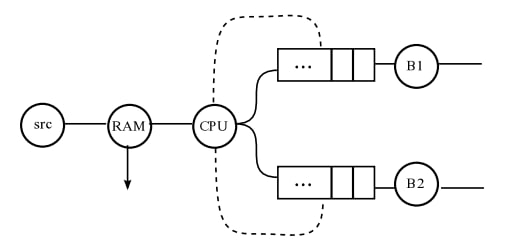
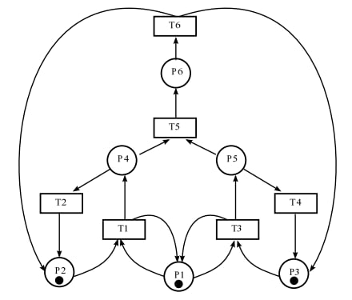
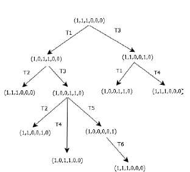
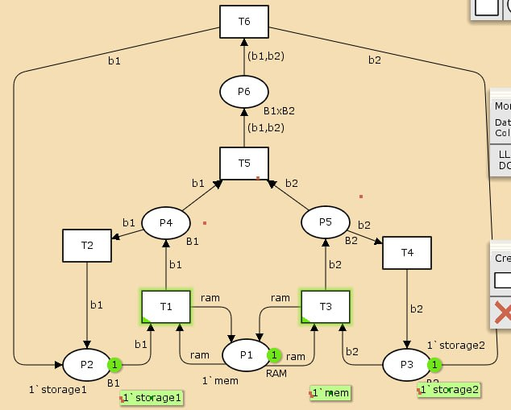
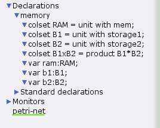
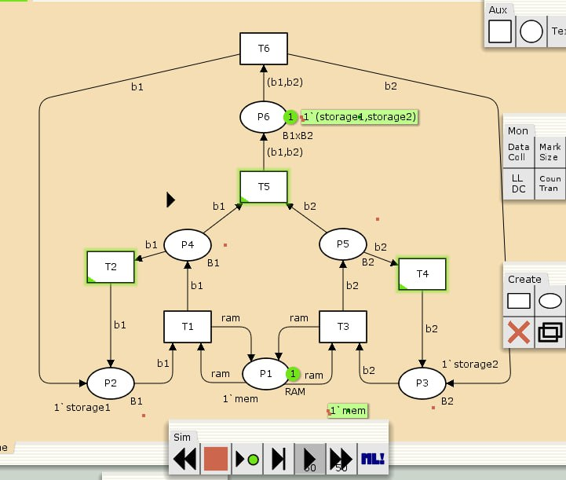
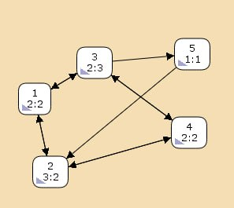

---
## Front matter
lang: ru-RU
title: Лабораторная работа 13
subtitle: Задание для самостоятельного выполнения
author:
  - Оразгелдиев Язгелди
institute:
  - Российский университет дружбы народов, Москва, Россия

## i18n babel
babel-lang: russian
babel-otherlangs: english

## Formatting pdf
toc: false
toc-title: Содержание
slide_level: 2
aspectratio: 169
section-titles: true
theme: metropolis
header-includes:
 - \metroset{progressbar=frametitle,sectionpage=progressbar,numbering=fraction}
---

# Информация

## Докладчик

  * Оразгелдиев Язгелди
  * студент
  * Российский университет дружбы народов
  * [orazgeldiyev.yazgeldi@gmail.com](mailto:orazgeldiyev.yazgeldi@gmail.com)
  * <https://github.com/YazgeldiOrazgeldiyev>

## Задание

1. Используя теоретические методы анализа сетей Петри, проведите анализ сети, изображённой на рис. 13.2 (с помощью построения дерева достижимости). Определите, является ли сеть безопасной, ограниченной, сохраняющей, имеются ли тупики.
2. Промоделируйте сеть Петри (см. рис. 13.2) с помощью CPNTools.
3. Вычислите пространство состояний. Сформируйте отчёт о пространстве состояний и проанализируйте его. Постройте граф пространства состояний.

## Содержание исследования

{#fig:001 width=70%}

## Содержание исследования

Описание модели

Сеть Петри моделируемой системы представлена на рис. 13.2.
Множество позиций:
P1 — состояние оперативной памяти (свободна / занята);
P2 — состояние внешнего запоминающего устройства B1 (свободно / занято);
P3 — состояние внешнего запоминающего устройства B2 (свободно / занято);
P4 — работа на ОП и B1 закончена;
P5 — работа на ОП и B2 закончена;
P6 — работа на ОП, B1 и B2 закончена;

## Содержание исследования

{#fig:002 width=40%}

## Содержание исследования

{#fig:003 width=40%}

## Содержание исследования

{#fig:004 width=40%}

## Содержание исследования

{#fig:005 width=40%}

## Содержание исследования

{#fig:006 width=40%}

## Содержание исследования

Изучим пространство состояний, их всего 5

{#fig:007 width=40%}

## Содержание исследования

Вычислим пространство состояний. Это мы делаем по схеме как в прошлых лабораторных работах. ВХодим в пространство состояние, вычисляем пространство состояний к листу, и формируем отчёт. Сохраняем его и открываем

В итоге из отчёта выясняем что:
- есть 5 состояний и 10 переходов между ними, strongly connected components (SCC) graph содержит 1 вершину и 0 переходов
- Указаны границы значений для каждого элемента: состояние Р1 всегда заполнено 1 элементом, а остальные содержат максимум один элемент, минимум ноль 
- Указаны границы в виде мультимножеств
- Маркировка Home для всех состояний, так как в любую позиицию мы можем попасть из любой другой маркировки
- Маркировка dead равна None, т.к. нет состояний из которых перехода быть не может
- в конце указано что бесконечно часто могут происходить переходы Т1 Т2 Т3 Т4, но необязательно, также Т5 нужно для того чтобы система не попадала в тупик, а Т6 происходит всегда, если доступно.

## Результаты

В ходе лабораторной работы мы выполнили задание для самостоятельного выполнения, провели анализ Сети Петри, построили сеть в CPNTools, построили граф состояний и провели его анализ
