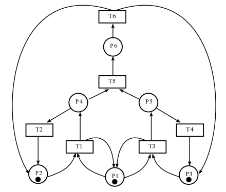

---
## Front matter
title: "Лабораторная работа 13"
subtitle: "Задание для самостоятельного выполнения"
author: "Оразгелдиев Язгелди"

## Generic otions
lang: ru-RU
toc-title: "Содержание"

## Bibliography
bibliography: bib/cite.bib
csl: pandoc/csl/gost-r-7-0-5-2008-numeric.csl

## Pdf output format
toc: true # Table of contents
toc-depth: 2
lof: true # List of figures
lot: true # List of tables
fontsize: 12pt
linestretch: 1.5
papersize: a4
documentclass: scrreprt
## I18n polyglossia
polyglossia-lang:
  name: russian
  options:
	- spelling=modern
	- babelshorthands=true
polyglossia-otherlangs:
  name: english
## I18n babel
babel-lang: russian
babel-otherlangs: english
## Fonts
mainfont: IBM Plex Serif
romanfont: IBM Plex Serif
sansfont: IBM Plex Sans
monofont: IBM Plex Mono
mathfont: STIX Two Math
mainfontoptions: Ligatures=Common,Ligatures=TeX,Scale=0.94
romanfontoptions: Ligatures=Common,Ligatures=TeX,Scale=0.94
sansfontoptions: Ligatures=Common,Ligatures=TeX,Scale=MatchLowercase,Scale=0.94
monofontoptions: Scale=MatchLowercase,Scale=0.94,FakeStretch=0.9
mathfontoptions:
## Biblatex
biblatex: true
biblio-style: "gost-numeric"
biblatexoptions:
  - parentracker=true
  - backend=biber
  - hyperref=auto
  - language=auto
  - autolang=other*
  - citestyle=gost-numeric
## Pandoc-crossref LaTeX customization
figureTitle: "Рис."
tableTitle: "Таблица"
listingTitle: "Листинг"
lofTitle: "Список иллюстраций"
lotTitle: "Список таблиц"
lolTitle: "Листинги"
## Misc options
indent: true
header-includes:
  - \usepackage{indentfirst}
  - \usepackage{float} # keep figures where there are in the text
  - \floatplacement{figure}{H} # keep figures where there are in the text
---

# Задание

1. Используя теоретические методы анализа сетей Петри, проведите анализ сети, изображённой на рис. 13.2 (с помощью построения дерева достижимости). Определите, является ли сеть безопасной, ограниченной, сохраняющей, имеются ли тупики.
2. Промоделируйте сеть Петри (см. рис. 13.2) с помощью CPNTools.
3. Вычислите пространство состояний. Сформируйте отчёт о пространстве состояний и проанализируйте его. Постройте граф пространства состояний.

# Выполнение лабораторной работы

Заявка (команды программы, операнды) поступает в оперативную память (ОП), затем передается на прибор (центральный процессор, ЦП) для обработки. После этого заявка может равновероятно обратиться к оперативной памяти или к одному из двух внешних запоминающих устройств (B1 и B2). Прежде чем записать информацию на внешний накопитель, необходимо вторично обратиться к центральному процессору, определяющему состояние накопителя и выдающему необходимую управляющую информацию. Накопители (B1 и B2) могут работать в 3-х режимах:
1) B1 — занят, B2 — свободен;
2) B2 — свободен, B1 — занят;
3) B1 — занят, B2 — занят.

{#fig:001 width=70%}

Описание модели

Сеть Петри моделируемой системы представлена на рис. 13.2.
Множество позиций:
P1 — состояние оперативной памяти (свободна / занята);
P2 — состояние внешнего запоминающего устройства B1 (свободно / занято);
P3 — состояние внешнего запоминающего устройства B2 (свободно / занято);
P4 — работа на ОП и B1 закончена;
P5 — работа на ОП и B2 закончена;
P6 — работа на ОП, B1 и B2 закончена;
Множество переходов:

T1 — ЦП работает только с RAM и B1;
T2 — обрабатываются данные из RAM и с B1 переходят на устройство вывода;
T3 — CPU работает только с RAM и B2;
T4 — обрабатываются данные из RAM и с B2 переходят на устройство вывода;
T5 — CPU работает только с RAM и с B1, B2;
T6 — обрабатываются данные из RAM, B1, B2 и переходят на устройство вывода.
Функционирование сети Петри можно расматривать как срабатывание переходов, в ходе которого происходит перемещение маркеров по позициям: 
- работа CPU с RAM и B1 отображается запуском перехода T1 (удаление маркеров из P1, P2 и появление в P1, P4), что влечет за собой срабатывание перехода T2, т.е. передачу данных с RAM и B1 на устройство вывода;
- работа CPU с RAM и B2 отображается запуском перехода T3 (удаление маркеров из P1 и P3 и появление в P1 и P5), что влечет за собой срабатывание перехода T4, т.е. передачу данных с RAM и B2 на устройство вывода;
– работа CPU с RAM, B1 и B2 отображается запуском перехода T5 (удаление маркеров из P4 и P5 и появление в P6), далее срабатывание перехода T6, и данные из RAM, B1 и B2 передаются на устройство вывода;
– состояние устройств восстанавливается при срабатывании: RAM — переходов T1 или T2; B1 — переходов T2 или T6; B2 — переходов T4 или T6.

{#fig:002 width=70%}

Анализ сети Петри
Построим дерево достижимости

{#fig:003 width=70%}

Промоделирую сеть Петри с помощью CPNTools. Создаем новую сеть, добавляем 6 позиций и 6 блоков переходов, затем их нужно соединить, и еще задать параметры и начальные значения.
В итоге получаем готовую модель

{#fig:004 width=70%}

Еще зададим нужные декларации

{#fig:005 width=70%}

Запустив модель, посмотрим как она работает

{#fig:006 width=70%}

Пространство состояний.

Изучим пространство состояний, их всего 5

{#fig:007 width=70%}

Вычислим пространство состояний. Это мы делаем по схеме как в прошлых лабораторных работах. ВХодим в пространство состояние, вычисляем пространство состояний к листу, и формируем отчёт. Сохраняем его и открываем

В итоге из отчёта выясняем что:

- есть 5 состояний и 10 переходов между ними, strongly connected components (SCC) graph содержит 1 вершину и 0 переходов

- Указаны границы значений для каждого элемента: состояние Р1 всегда заполнено 1 элементом, а остальные содержат максимум один элемент, минимум ноль 

- Указаны границы в виде мультимножеств

- Маркировка Home для всех состояний, так как в любую позиицию мы можем попасть из любой другой маркировки

- Маркировка dead равна None, т.к. нет состояний из которых перехода быть не может

- в конце указано что бесконечно часто могут происходить переходы Т1 Т2 Т3 Т4, но необязательно, также Т5 нужно для того чтобы система не попадала в тупик, а Т6 происходит всегда, если доступно.

```
CPN Tools state space report for:
/home/openmodelica/cpnl13.cpn
Report generated: Sat May  3 03:39:06 2025


 Statistics
------------------------------------------------------------------------

  State Space
     Nodes:  5
     Arcs:   10
     Secs:   0
     Status: Full

  Scc Graph
     Nodes:  1
     Arcs:   0
     Secs:   0


 Boundedness Properties
------------------------------------------------------------------------

  Best Integer Bounds
                             Upper      Lower
     petri'P1 1              1          1
     petri'P2 1              1          0
     petri'P3 1              1          0
     petri'P4 1              1          0
     petri'P5 1              1          0
     petri'P6 1              1          0

  Best Upper Multi-set Bounds
     petri'P1 1          1`memory
     petri'P2 1          1`storage1
     petri'P3 1          1`storage2
     petri'P4 1          1`storage1
     petri'P5 1          1`storage2
     petri'P6 1          1`(storage1,storage2)

  Best Lower Multi-set Bounds
     petri'P1 1          1`memory
     petri'P2 1          empty
     petri'P3 1          empty
     petri'P4 1          empty
     petri'P5 1          empty
     petri'P6 1          empty


 Home Properties
------------------------------------------------------------------------

  Home Markings
     All


 Liveness Properties
------------------------------------------------------------------------

  Dead Markings
     None

  Dead Transition Instances
     None

  Live Transition Instances
     All


 Fairness Properties
------------------------------------------------------------------------
       petri'T1 1             No Fairness
       petri'T2 1             No Fairness
       petri'T3 1             No Fairness
       petri'T4 1             No Fairness
       petri'T5 1             Just
       petri'T6 1             Fair
```


# Выводы

В ходе лабораторной работы мы выполнили задание для самостоятельного выполнения, провели анализ Сети Петри, построили сеть в CPNTools, построили граф состояний и провели его анализ
