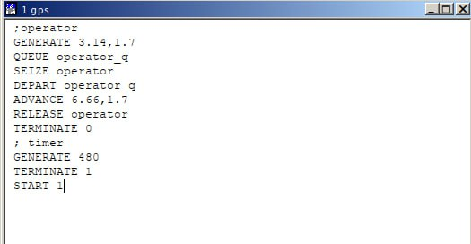

---
## Front matter
lang: ru-RU
title: Лабораторная работа 14
subtitle: Модели обработки заказов
author:
  - Оразгелдиев Язгелди
institute:
  - Российский университет дружбы народов, Москва, Россия

## i18n babel
babel-lang: russian
babel-otherlangs: english

## Formatting pdf
toc: false
toc-title: Содержание
slide_level: 2
aspectratio: 169
section-titles: true
theme: metropolis
header-includes:
 - \metroset{progressbar=frametitle,sectionpage=progressbar,numbering=fraction}
---

# Информация

## Докладчик

  * Оразгелдиев Язгелди
  * студент
  * Российский университет дружбы народов
  * [orazgeldiyev.yazgeldi@gmail.com](mailto:orazgeldiyev.yazgeldi@gmail.com)
  * <https://github.com/YazgeldiOrazgeldiyev>

## Цель работы

Реализовать модели обработки заказов и провести анализ результатов.

## Задание

Реализовать с помощью gpss:

- модель оформления заказов клиентов одним оператором;
- построение гистограммы распределения заявок в очереди;
- модель обслуживания двух типов заказов от клиентов в интернет-магазине;
- модель оформления заказов несколькими операторами.

## Содержание исследования

{#fig:001 width=70%}

## Содержание исследования

{#fig:002 width=70%}

## Содержание исследования

Результаты работы модели:

- модельное время в начале моделирования: `START TIME`=0.0;
- абсолютное время или момент, когда счетчик завершений принял значение 0: `END TIME`=480.0;
- количество блоков, использованных в текущей модели, к моменту завершения моделирования: `BLOCKS`=9;
- количество одноканальных устройств, использованных в модели к моменту завершения моделирования: `FACILITIES`=1;
- количество многоканальных устройств, использованных в текущей модели к моменту завершения моделирования: `STORAGES`=0. Имена, используемые в программе модели: `operator`, `operator_q`. 

## Содержание исследования

{#fig:003 width=70%}

## Содержание исследования

{#fig:004 width=70%}

## Содержание исследования

Результаты работы модели:

- модельное время в начале моделирования: `START TIME`=0.0;
- абсолютное время или момент, когда счетчик завершений принял значение 0: `END TIME`=480.0;
- количество блоков, использованных в текущей модели, к моменту завершения моделирования: `BLOCKS`=9;
- количество одноканальных устройств, использованных в модели к моменту завершения моделирования: `FACILITIES`=1;
- количество многоканальных устройств, использованных в текущей модели к моменту завершения моделирования: `STORAGES`=0. 

## Содержание исследования

{#fig:005 width=70%}

## Содержание исследования

{#fig:006 width=70%}

Результаты работы модели:

- модельное время в начале моделирования: `START TIME`=0.0;
- абсолютное время или момент, когда счетчик завершений принял значение 0: `END TIME`=353.895;
- количество блоков, использованных в текущей модели, к моменту завершения моделирования: `BLOCKS`=10;
- количество одноканальных устройств, использованных в модели к моменту завершения моделирования: `FACILITIES`=1;
- количество многоканальных устройств, использованных в текущей модели к моменту завершения моделирования: `STORAGES`=0. 

## Содержание исследования

{#fig:007 width=70%}

## Содержание исследования

Частотность разделена на 15 частотных интервалов с шагом 2 и началом в 0, как мы и задали. Наибольшее количество заявок (17) обрабатывалось 10-12 минут, 14 заявок -- 12-14 минут, 12 заявок -- 8-10 минут, в остальных диапазонах 0-4 заявок. 

## Содержание исследования

{#fig:008 width=70%}

## Содержание исследования

{#fig:009 width=70%}

## Содержание исследования

Результаты работы модели:

- модельное время в начале моделирования: `START TIME`=0.0;
- абсолютное время или момент, когда счетчик завершений принял значение 0: `END TIME`=480.0;
- количество блоков, использованных в текущей модели, к моменту завершения моделирования: `BLOCKS`=17;
- количество одноканальных устройств, использованных в модели к моменту завершения моделирования: `FACILITIES`=1;
- количество многоканальных устройств, использованных в текущей модели к моменту завершения моделирования: `STORAGES`=0. 

## Содержание исследования

{#fig:010 width=70%}

## Содержание исследования

{#fig:011 width=70%}

## Содержание исследования

Результаты работы модели:

- модельное время в начале моделирования: `START TIME`=0.0;
- абсолютное время или момент, когда счетчик завершений принял значение 0: `END TIME`=480.0;
- количество блоков, использованных в текущей модели, к моменту завершения моделирования: `BLOCKS`=11;
- количество одноканальных устройств, использованных в модели к моменту завершения моделирования: `FACILITIES`=1;
- количество многоканальных устройств, использованных в текущей модели к моменту завершения моделирования: `STORAGES`=0. 

## Содержание исследования

{#fig:012 width=70%}

## Содержание исследования

{#fig:013 width=70%}

Результаты работы модели:

- модельное время в начале моделирования: `START TIME`=0.0;
- абсолютное время или момент, когда счетчик завершений принял значение 0: `END TIME`=480.0;
- количество блоков, использованных в текущей модели, к моменту завершения моделирования: `BLOCKS`=9;
- количество одноканальных устройств, использованных в модели к моменту завершения моделирования: `FACILITIES`=1;
- количество многоканальных устройств, использованных в текущей модели к моменту завершения моделирования: `STORAGES`=0. 

## Результаты

Я реализовал модель оформления заказов клиентов одним оператором, модель обслуживания двух типов заказов от клиентов в интернет-магазине и модель оформления заказов несколькими операторами.

