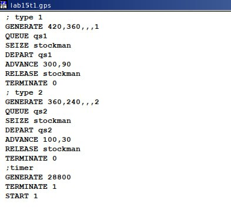
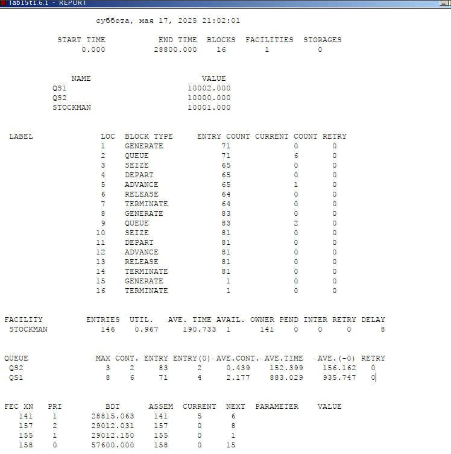
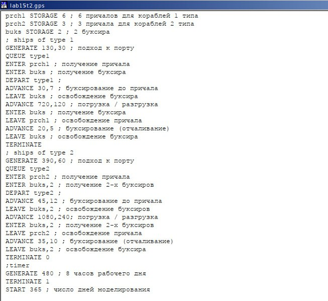
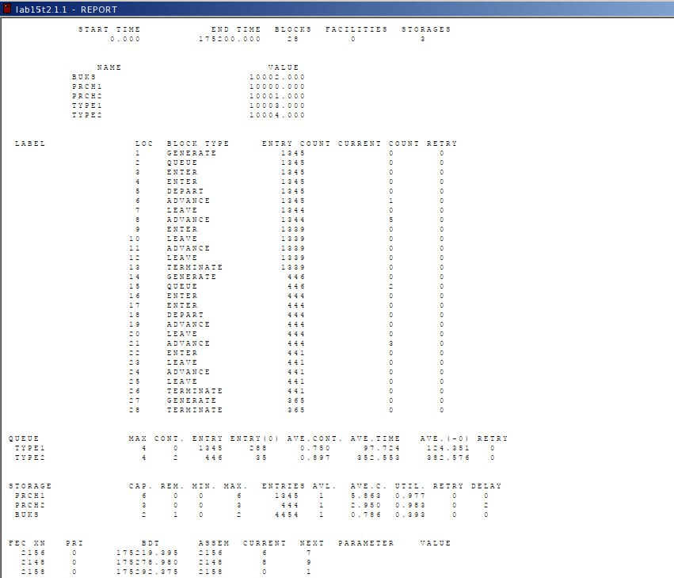

---
## Front matter
lang: ru-RU
title: Лабораторная работа 15
subtitle: Модели обслуживания с приоритетами
author:
  - Оразгелдиев Язгелди
institute:
  - Российский университет дружбы народов, Москва, Россия

## i18n babel
babel-lang: russian
babel-otherlangs: english

## Formatting pdf
toc: false
toc-title: Содержание
slide_level: 2
aspectratio: 169
section-titles: true
theme: metropolis
header-includes:
 - \metroset{progressbar=frametitle,sectionpage=progressbar,numbering=fraction}
---

# Информация

## Докладчик

  * Оразгелдиев Язгелди
  * студент
  * Российский университет дружбы народов
  * [orazgeldiyev.yazgeldi@gmail.com](mailto:orazgeldiyev.yazgeldi@gmail.com)
  * <https://github.com/YazgeldiOrazgeldiyev>

## Цель работы

Реализовать модели обслуживания с приоритетами и провести анализ результатов.

## Задание

Реализовать с помощью gpss:

- Модель обслуживания механиков на складе
- Модель обслуживания в порту судов двух типов

## Содержание исследования

{#fig:001 width=40%}

## Содержание исследования

{#fig:002 width=40%}

## Содержание исследования

Результаты работы модели:

- модельное время в начале моделирования: `START TIME`=0.0;
- абсолютное время или момент, когда счетчик завершений принял значение 0: `END TIME`=28800.0;
- количество блоков, использованных в текущей модели, к моменту завершения моделирования: `BLOCKS`=16;
- количество одноканальных устройств, использованных в модели к моменту завершения моделирования: `FACILITIES`=1;
- количество многоканальных устройств, использованных в текущей модели к моменту завершения моделирования: `STORAGES`=0. Имена, используемые в программе модели: `QS1`(первый тип заявок), `QS2`(второй тип заявок), `STOCKMAN`(обработчик заявок). 

## Содержание исследования

- `XN`=141 -- порядковый номер заявки от клиента, ожидающей поступления для оформления заказа у оператора;
- `PRI`=1 -- следующая заявка с приоритетом 1, то есть первого типа;
- `BDT`=28815,063 -- время назначенного события, связанного с данным транзактом;
- `ASSEM`=141 -- номер семейства транзактов;
- `CURRENT`=5 -- номер блока, в котором находится транзакт;
- `NEXT`=6 -- номер блока, в который должен войти транзакт.

## Содержание исследования

{#fig:003 width=40%}

## Содержание исследования

{#fig:004 width=40%}

## Содержание исследования

Результаты работы модели:

- модельное время в начале моделирования: `START TIME`=0.0;
- абсолютное время или момент, когда счетчик завершений принял значение 0: `END TIME`=175200.0;
- количество блоков, использованных в текущей модели, к моменту завершения моделирования: `BLOCKS`=28;
- количество одноканальных устройств, использованных в модели к моменту завершения моделирования: `FACILITIES`=0;
- количество многоканальных устройств, использованных в текущей модели к моменту завершения моделирования: `STORAGES`=3. Имена, используемые в программе модели: `TYPE1`(первый тип судов), `TYPE2`(второй тип судов), `PRCH1`(первый тип причала), `PRCH2`(второй тип причала). 

## Результаты

В результате выполнения работы были реализованы с помощью gpss:

- Модель обслуживания механиков на складе;
- Модель обслуживания в порту судов двух типов.
