---
## Front matter
lang: ru-RU
title: Лабораторная работа 16
subtitle: Задачи оптимизации. Модель двух стратегий обслуживания
author:
  - Оразгелдиев Язгелди
institute:
  - Российский университет дружбы народов, Москва, Россия

## i18n babel
babel-lang: russian
babel-otherlangs: english

## Formatting pdf
toc: false
toc-title: Содержание
slide_level: 2
aspectratio: 169
section-titles: true
theme: metropolis
header-includes:
 - \metroset{progressbar=frametitle,sectionpage=progressbar,numbering=fraction}
---

# Информация

## Докладчик

  * Оразгелдиев Язгелди
  * студент
  * Российский университет дружбы народов
  * [orazgeldiyev.yazgeldi@gmail.com](mailto:orazgeldiyev.yazgeldi@gmail.com)
  * <https://github.com/YazgeldiOrazgeldiyev>

## Цель работы

Реализовать с помощью gpss модель двух стратегий обслуживания и оценить оптимальные параметры.

## Задание

Реализовать с помощью gpss:

- модель с двумя очередями;
- модель с одной очередью;
- изменить модели, чтобы определить оптимальное число пропускных пунктов.

## Содержание исследования

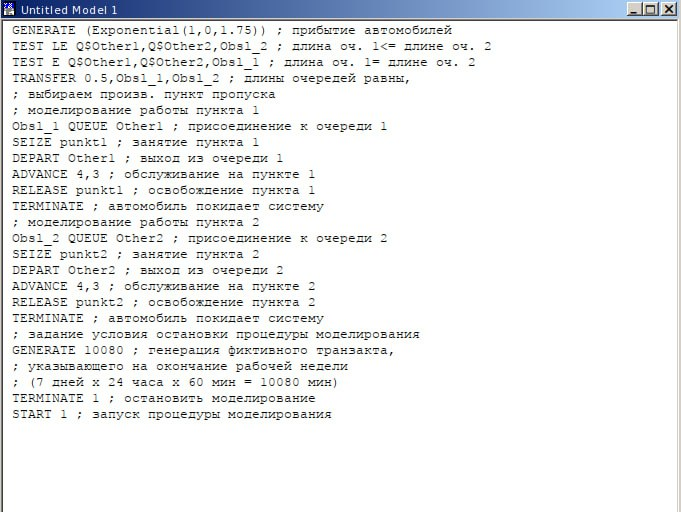{#fig:001 width=40%}

## Содержание исследования

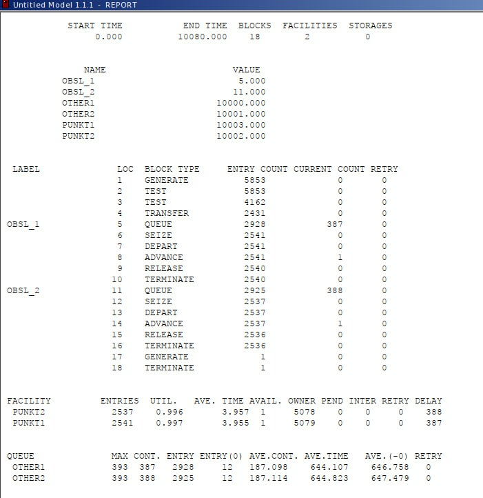{#fig:002 width=40%}

## Содержание исследования

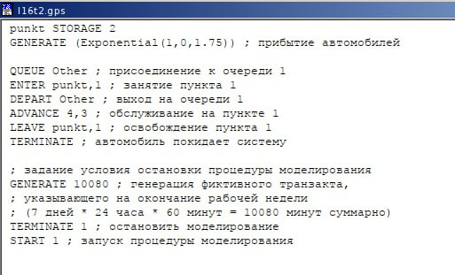{#fig:003 width=40%}

## Содержание исследования

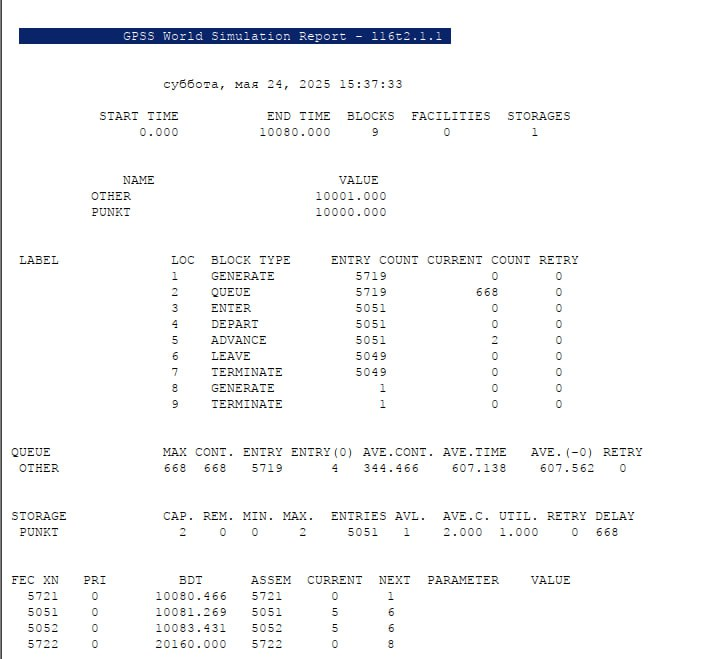{#fig:004 width=40%}

## Содержание исследования

Составим таблицу по полученной статистике

: Сравнение стратегий {#tbl:strategy}:

| Показатель                 | стратегия 1 |         |          |  стратегия 2 |
|----------------------------|-------------|---------|----------|--------------|
|                            | пункт 1     | пункт 2 | в целом  |              |
| Поступило автомобилей      | 2928        | 2925    | 5853     | 5719         |
| Обслужено автомобилей      | 2540        | 2536    | 5076     | 5049         |
| Коэффициент загрузки       | 0,997       | 0,996   | 0,9965   | 1            |
| Максимальная длина очереди | 393         | 393     | 786      | 668          |
| Средняя длина очереди      | 187,098     | 187,114 | 374,212  | 344,466      |
| Среднее время ожидания     | 644,107     | 644,823 | 644,465  | 607,138      |

## Содержание исследования

Сравнив результаты моделирования двух систем, можно сделать вывод о том,
что первая модель позволяет обслужить большее число автомобилей. Однако мы
видим, что разница между обслуженными и поступившими автомобилями меньше
для второй модели – значит, продуктивность работы выше. Также для второй модели коэффициент загрузки равен 1 -- значит ни один из
пунктов не простаивает. Максимальная длина очереди, средняя длина очереди и
среднее время ожидания меньше для второй стратегии. Можно сделать вывод, что
вторая стратегия лучше.

## Содержание исследования

Изменим модели, чтобы определить оптимальное число пропускных пунктов (от 1 до 4). Будем подбирать под следующие критерии:

- коэффициент загрузки пропускных пунктов принадлежит интервалу [0, 5; 0, 95];
- среднее число автомобилей, одновременно находящихся на контрольно пропускном пункте, не должно превышать 3;
- среднее время ожидания обслуживания не должно превышать 4 мин.

Для обеих стратегий модель с одним пунктом выглядит одинаково.

## Содержание исследования

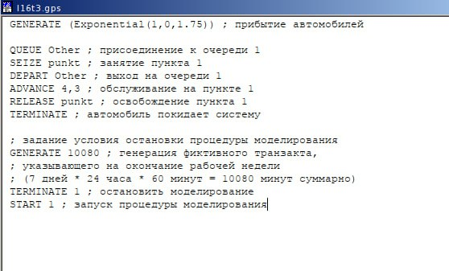{#fig:005 width=40%}

## Содержание исследования

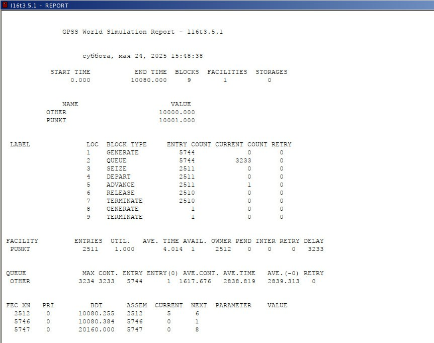{#fig:006 width=40%}

## Содержание исследования

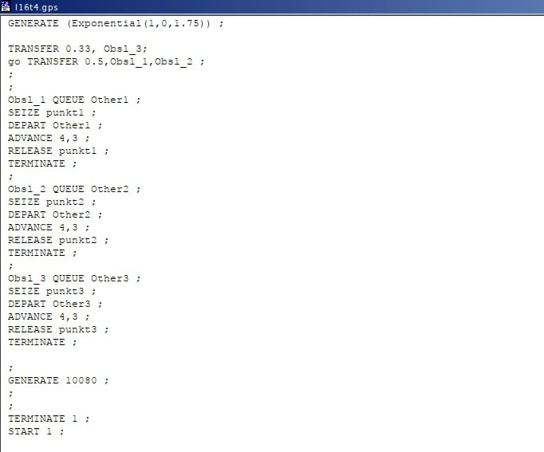{#fig:007 width=40%}

## Содержание исследования

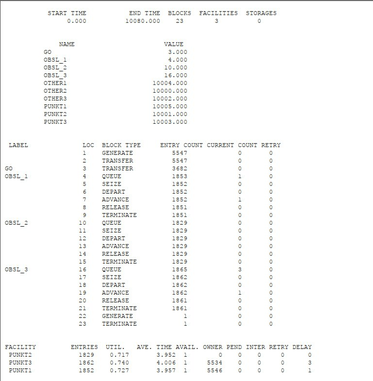{#fig:008 width=40%}

## Содержание исследования

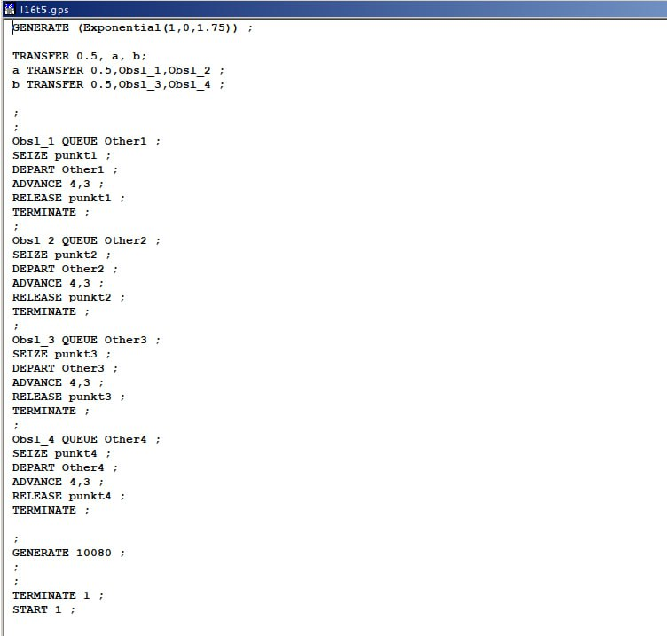{#fig:009 width=40%}

## Содержание исследования

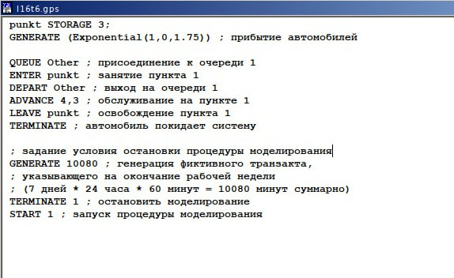{#fig:010 width=40%}

## Содержание исследования

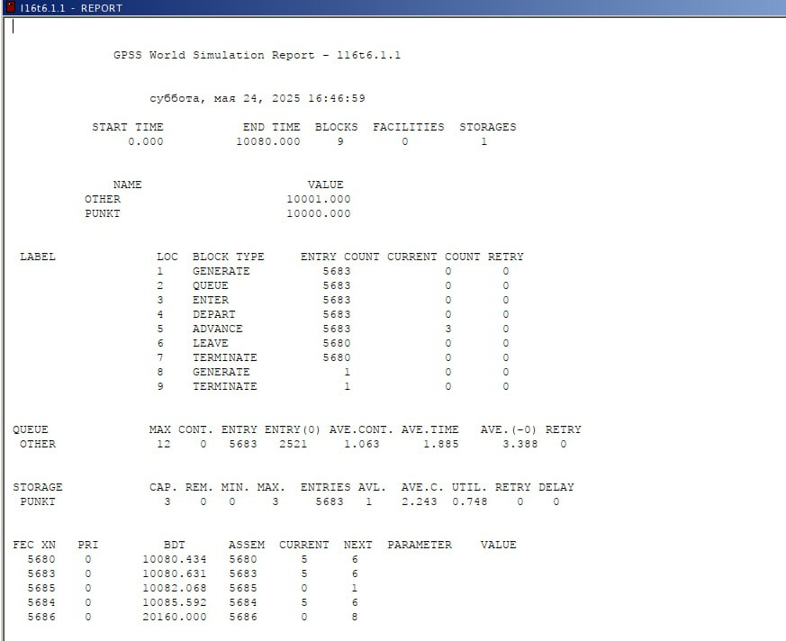{#fig:011 width=40%}

## Содержание исследования

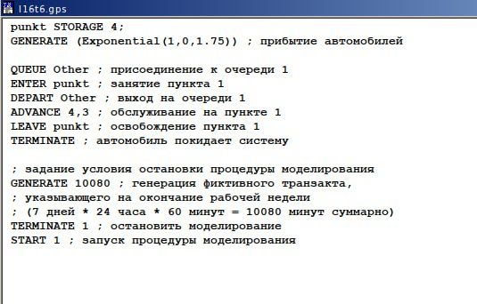{#fig:012 width=40%}

## Содержание исследования

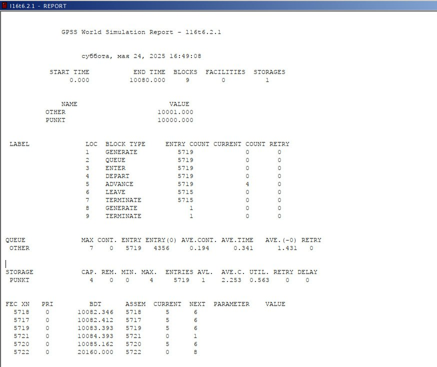{#fig:013 width=40%}

## Содержание исследования

Здесь все критерии выполнены при этом время ожидания и среднее число автомобилей меньше, чем в случае второй стратегии с 3 пунктами, однако и загрузка меньше. Можно сделать вывод, что 4 пропускной пункт излишне разгружает систему.

В результате анализа наилучшим количеством пропускных пунктов будет *3 при втором типе обслуживания* и *4 при первом*.

## Результаты

В результате выполнения данной лабораторной работы я реализовала с помощью gpss:

- модель с двумя очередями;
- модель с одной очередью;
- изменить модели, чтобы определить оптимальное число пропускных пунктов.
