---
## Front matter
lang: ru-RU
title: Лабораторная работа 17
subtitle: Задания для самостоятельной работы
author:
  - Оразгелдиев Язгелди
institute:
  - Российский университет дружбы народов, Москва, Россия

## i18n babel
babel-lang: russian
babel-otherlangs: english

## Formatting pdf
toc: false
toc-title: Содержание
slide_level: 2
aspectratio: 169
section-titles: true
theme: metropolis
header-includes:
 - \metroset{progressbar=frametitle,sectionpage=progressbar,numbering=fraction}
---

# Информация

## Докладчик

  * Оразгелдиев Язгелди
  * студент
  * Российский университет дружбы народов
  * [orazgeldiyev.yazgeldi@gmail.com](mailto:orazgeldiyev.yazgeldi@gmail.com)
  * <https://github.com/YazgeldiOrazgeldiyev>

## Цель работы

Реализовать с помощью gpss модели работы вычислительного центра, аэропорта и морского порта.

## Задание

Реализовать с помощью gpss:

- модель работы вычислительного центра;
- модель работы аэропорта;
- модель работы морского порта.

## Содержание исследования

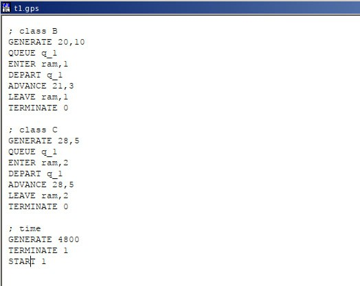{#fig:001 width=50%}

## Содержание исследования

Задается хранилище ram на две заявки. Затем записаны три блока: первые два обрабатывают задания класса A и B, используя один элемент ram, а третий обрабатывает задания класса C, используя два элемента ram. Также есть блок времени генерирующий 4800 минут (80 часов).

## Содержание исследования

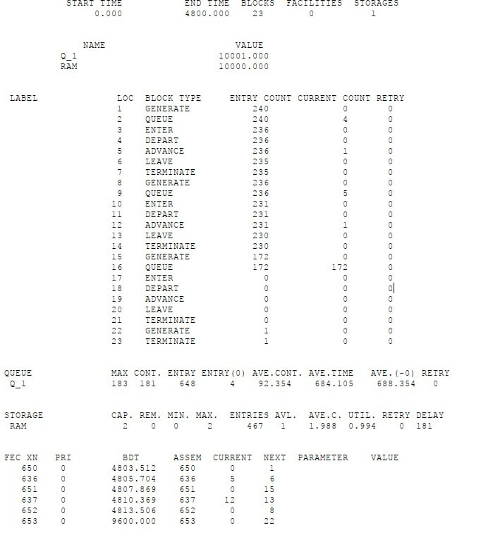{#fig:002 width=50%}

Из отчета увидим, что загруженность системы равна 0.994.

## Содержание исследования

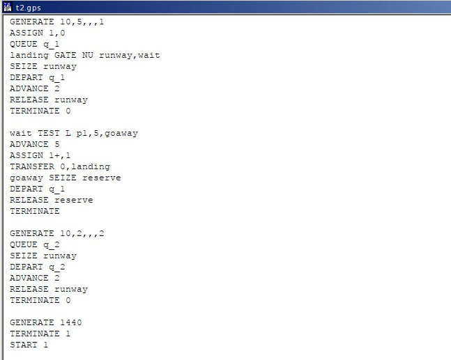{#fig:003 width=50%}

## Содержание исследования

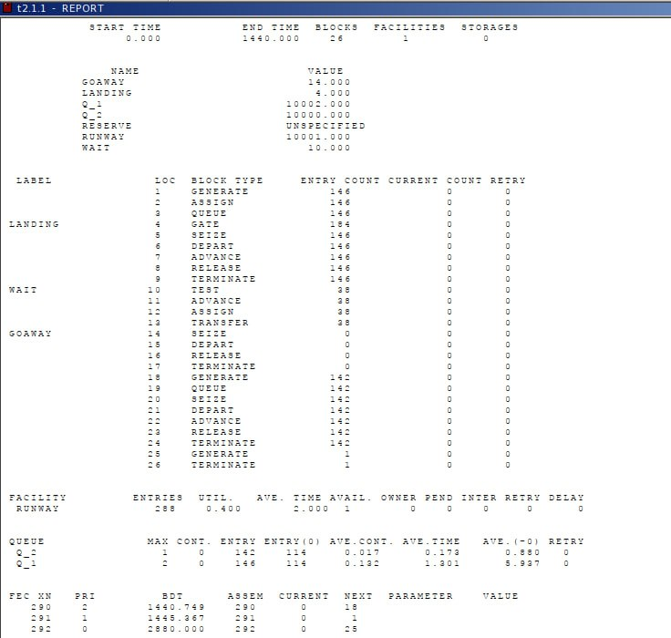{#fig:004 width=50%}

## Содержание исследования

Взлетело 142 самолета, село 146, а в запасной аэропорт отправилось 0. В запасной аэропорт не отправились самолеты, поскольку процессы обработки длятся всего 2 минуты, что намного быстрее, чем генерации новых самолетов. Коэффициент загрузки полосы равняется 0.4, полоса большую часть времени не используется.

## Содержание исследования

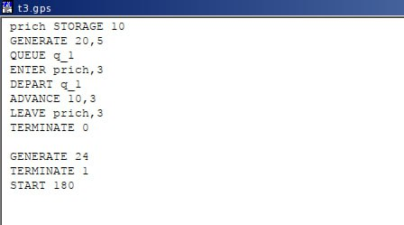{#fig:005 width=50%}

## Содержание исследования

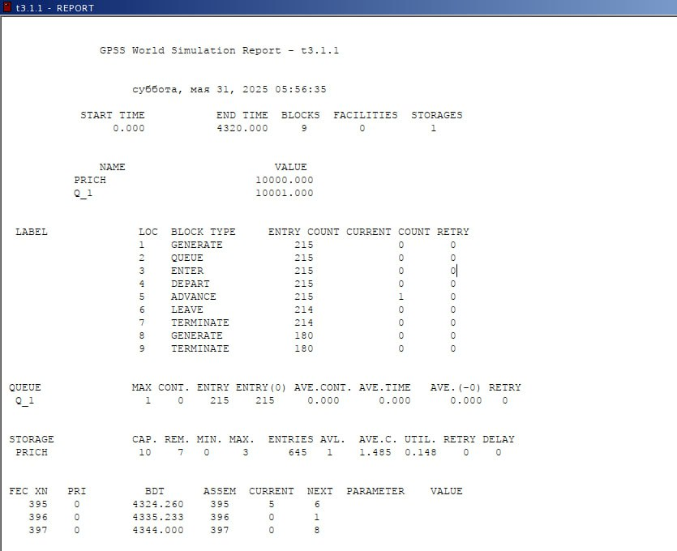{#fig:006 width=50%}

## Содержание исследования

При запуске с 10 причалами видно, что судна обрабатываются быстрее, чем успевают приходить новые, так как очередь не набирается. Кроме того загруженность причалов очень низкая. Соответственно, установив наименьшее возможное число причалов -- 3, получаем оптимальный результат, что видно на отчете.

## Содержание исследования

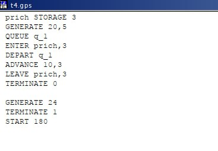{#fig:007 width=50%}

## Содержание исследования

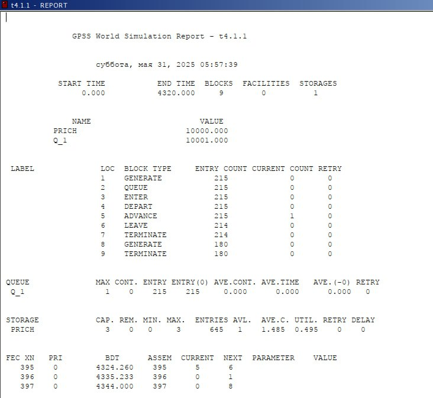{#fig:008 width=50%}

## Содержание исследования

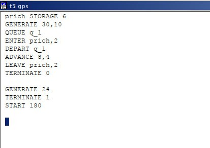{#fig:009 width=50%}

## Содержание исследования

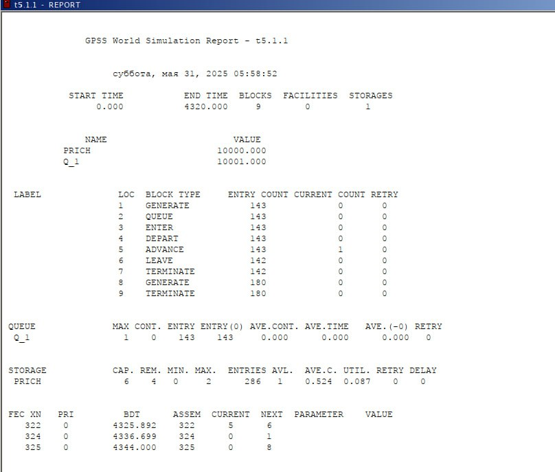{#fig:010 width=50%}

## Содержание исследования

При запуске с 6 причалами видно, что судна обрабатываются быстрее, чем успевают приходить новые, так как очередь не набирается. Кроме того загруженность причалов очень низкая. Соответственно, установив наименьшее возможное число причалов -- 2, получаем оптимальный результат, что видно из отчета.

## Содержание исследования

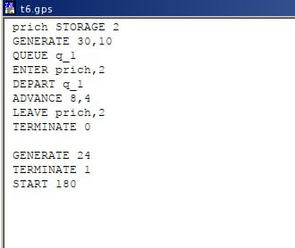{#fig:011 width=50%}

## Содержание исследования

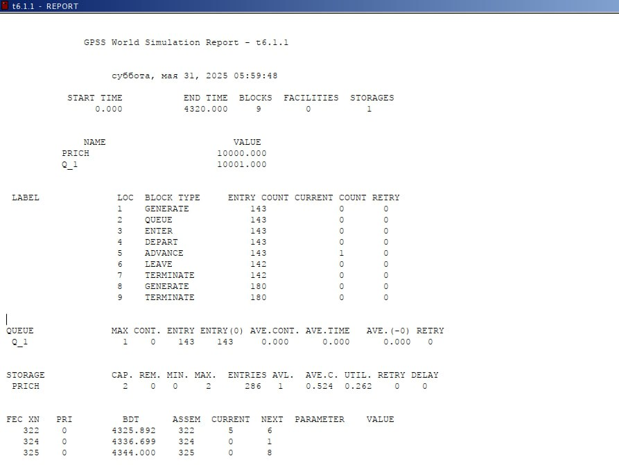{#fig:012 width=50%}

## Результаты

В результате выполнения данной лабораторной работы я реализовал с помощью gpss:

- модель работы вычислительного центра;
- модель работы аэропорта;
- модель работы морского порта.
